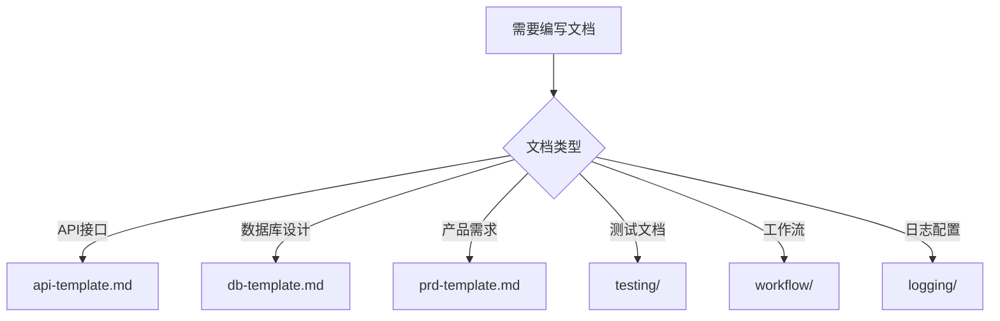

# 开发规范与模板库

> 该仓库用于定义与统一团队的开发标准，提供各类开发文档模板和规范指南。

---

## 📚 目录

- [快速开始](#快速开始)
- [快速导航](#快速导航)
- [模板导航](#模板导航)
  - [编码规范](#编码规范)
  - [API 接口文档](#api-接口文档)
  - [数据库设计](#数据库设计)
  - [产品需求文档](#产品需求文档)
  - [测试文档](#测试文档)
  - [工作流文档](#工作流文档)
  - [日志配置](#日志配置)
  - [GitHub 规范](#github-规范)
- [使用指南](#使用指南)
- [贡献指南](#贡献指南)

---

## 🔗 快速导航

常用规范文档快速链接：

- **编码规范**: [`coding/coding.md`](coding/coding.md)
- **代码注释规范**: [`coding/comment.md`](coding/comment.md)
- **分支与 PR 规范**: [`github/git-flow.md`](github/git-flow.md)
- **发布与 Tag/Release 规范**: [`github/git-release.md`](github/git-release.md)

---

## 🚀 快速开始

### 1. 选择合适的模板

根据你的需求选择合适的模板：

- **编码规范** → [`coding/`](#编码规范)
- **API 文档** → [`api/`](#api-接口文档)
- **数据库设计** → [`db/`](#数据库设计)
- **产品需求文档** → [`prd/`](#产品需求文档)
- **测试文档** → [`testing/`](#测试文档)
- **工作流文档** → [`workflow/`](#工作流文档)
- **日志配置** → [`logging/`](#日志配置)
- **GitHub 规范** → [`github/`](#github-规范)

### 2. 复制模板

```bash
# 克隆仓库
git clone <repository-url>
cd develop-rules

# 复制模板到你的项目
cp prd/prd-template.md /path/to/your/project/docs/
```

### 3. 填写模板

打开模板文件，按照说明填写相关内容。

---

## 📋 模板导航

### 编码规范

| 模板文件 | 说明 | 适用场景 |
|---------|------|----------|
| [`coding/coding.md`](coding/coding.md) | 编码规范 | 团队编码标准和风格指南 |
| [`coding/comment.md`](coding/comment.md) | 代码注释规范 | 代码注释编写规范和最佳实践 |

**使用场景**:
- 制定团队编码标准
- 代码审查参考
- 新人入职培训

**快速开始**:
```bash
# 查看编码规范
cat coding/coding.md

# 查看注释规范
cat coding/comment.md
```

**特点**:
- ✅ 统一的编码风格
- ✅ 代码注释最佳实践
- ✅ 提高代码可读性和可维护性

---

### API 接口文档

| 模板文件 | 说明 | 适用场景 |
|---------|------|----------|
| [`api/api-template.md`](api/api-template.md) | REST API 接口文档模板 | RESTful API 接口设计文档 |

**使用场景**:
- 设计新的 API 接口
- 编写 API 文档
- API 接口评审

**快速开始**:
```bash
cp api/api-template.md docs/api/your-api.md
```

---

### 数据库设计

| 模板文件 | 说明 | 适用场景 |
|---------|------|----------|
| [`db/db-template.md`](db/db-template.md) | 数据库表设计说明文档模板 | 数据库表结构设计、字段说明、索引设计 |

**使用场景**:
- 设计新数据库表
- 数据库表结构评审
- 数据库设计文档编写

**快速开始**:
```bash
cp db/db-template.md docs/db/your-table.md
```

**特点**:
- ✅ 完整的表结构说明
- ✅ 索引设计规范
- ✅ ER 图示例
- ✅ 变更历史记录
- ✅ 性能优化建议

---

### 产品需求文档

| 模板文件 | 说明 | 适用场景 |
|---------|------|----------|
| [`prd/prd-template.md`](prd/prd-template.md) | 标准产品需求文档模板 | 完整的产品需求文档 |
| [`prd/agile-prd-template.md`](prd/agile-prd-template.md) | 敏捷开发 PRD 模板 | 敏捷开发流程中的需求文档 |
| [`prd/lean-startup-prd-template.md`](prd/lean-startup-prd-template.md) | 精益创业 PRD 模板 | MVP 和快速迭代场景 |
| [`prd/waterfall-prd-template.md`](prd/waterfall-prd-template.md) | 瀑布模型 PRD 模板 | 传统瀑布开发流程 |
| [`prd/prd-sub-module-template.md`](prd/prd-sub-module-template.md) | 子模块 PRD 模板 | 大型项目的子模块需求 |

**使用场景**:
- 新产品功能设计
- 功能需求评审
- 产品规划文档

**如何选择**:
- **标准模板**: 适用于大多数场景
- **敏捷模板**: 适用于 Scrum/Kanban 团队
- **精益模板**: 适用于 MVP 和快速验证
- **瀑布模板**: 适用于传统项目
- **子模块模板**: 适用于大型项目的子模块

**快速开始**:
```bash
# 标准 PRD
cp prd/prd-template.md docs/prd/feature-xxx.md

# 敏捷 PRD
cp prd/agile-prd-template.md docs/prd/sprint-xxx.md
```

---

### 测试文档

| 模板文件 | 说明 | 适用场景 |
|---------|------|----------|
| [`testing/automation-testing-guide.md`](testing/automation-testing-guide.md) | 自动化测试指南 | 自动化测试策略和规范 |
| [`testing/e2e-testing-guide.md`](testing/e2e-testing-guide.md) | E2E 测试指南 | 端到端测试规范 |
| [`testing/integration-testing-guide.md`](testing/integration-testing-guide.md) | 集成测试指南 | 集成测试规范 |
| [`testing/ut-testing-guide.md`](testing/ut-testing-guide.md) | 单元测试指南 | 单元测试规范和最佳实践 |

**使用场景**:
- 编写测试计划
- 测试用例设计
- 测试规范制定

**快速开始**:
```bash
cp testing/automation-testing-guide.md docs/testing/automation-guide.md
```

---

### 工作流文档

| 模板文件 | 说明 | 适用场景 |
|---------|------|----------|
| [`workflow/AI自动化开发工作流.md`](workflow/AI自动化开发工作流.md) | AI 自动化开发工作流 | 使用 AI 工具进行全生命周期开发 |
| [`workflow/deploy-terraform.md`](workflow/deploy-terraform.md) | Terraform 部署工作流 | AWS Lambda + API Gateway 部署 |
| [`workflow/fix-compilation-errors.md`](workflow/fix-compilation-errors.md) | 编译错误修复流程 | 解决编译错误的标准流程 |
| [`workflow/refactor-entity.md`](workflow/refactor-entity.md) | 实体重构流程 | 数据库实体重构指南 |

**使用场景**:
- AI 辅助开发全流程
- 部署流程文档
- 问题排查指南
- 重构流程规范

---

### 日志配置

| 模板文件 | 说明 | 适用场景 |
|---------|------|----------|
| [`logging/01-多服务-datadog-分布式追踪配置模板.md`](logging/01-多服务-datadog-分布式追踪配置模板.md) | 多服务 Datadog 分布式追踪 | 多服务微服务架构，需要分布式追踪 |
| [`logging/02-单服务日志配置模板.md`](logging/02-单服务日志配置模板.md) | 单服务日志配置 | 单服务应用，简单的日志管理需求 |
| [`logging/03-其他日志配置模板.md`](logging/03-其他日志配置模板.md) | 其他日志配置 | ELK、Fluentd、Kubernetes、审计日志等 |

**使用场景**:
- 配置多服务分布式追踪（通过 `span_id` 和 `parent_span_id`）
- 单服务日志管理
- 云原生环境日志配置
- 企业级日志管理（ELK、Splunk）

**快速开始**:
```bash
# 查看多服务 Datadog 模板
cat logging/01-多服务-datadog-分布式追踪配置模板.md

# 查看单服务模板
cat logging/02-单服务日志配置模板.md

# 查看其他模板
cat logging/03-其他日志配置模板.md
```

**特点**:
- ✅ 支持 Java、Node.js、Python 多语言
- ✅ 完整的分布式追踪实现
- ✅ 多种日志管理方案（Datadog、ELK、Fluentd、Splunk）
- ✅ 云原生环境支持（Kubernetes）

---

### GitHub 规范

| 模板文件 | 说明 | 适用场景 |
|---------|------|----------|
| [`github/git-flow.md`](github/git-flow.md) | Git Flow 分支管理规范 | 分支命名、PR 流程 |
| [`github/git-release.md`](github/git-release.md) | 版本发布规范 | 版本号、Tag、Release |
| [`github/GITHUB_ISSUES_GUIDE.md`](github/GITHUB_ISSUES_GUIDE.md) | GitHub Issues 使用指南 | Issue 创建和管理 |
| [`github/github-issue-templates/`](github/github-issue-templates/) | Issue 模板集合 | 各类 Issue 模板 |

**Issue 模板**:
- [`issue-01-platform.md`](github/github-issue-templates/issue-01-platform.md) - 平台相关 Issue
- [`issue-02-database.md`](github/github-issue-templates/issue-02-database.md) - 数据库相关 Issue
- [`issue-03-sync-mechanism.md`](github/github-issue-templates/issue-03-sync-mechanism.md) - 同步机制 Issue
- [`issue-04-performance.md`](github/github-issue-templates/issue-04-performance.md) - 性能相关 Issue
- [`issue-05-business.md`](github/github-issue-templates/issue-05-business.md) - 业务相关 Issue
- [`issue-06-tech-stack.md`](github/github-issue-templates/issue-06-tech-stack.md) - 技术栈相关 Issue
- [`issue-07-security.md`](github/github-issue-templates/issue-07-security.md) - 安全相关 Issue

**使用场景**:
- 创建新分支
- 提交 Pull Request
- 发布新版本
- 创建和管理 Issue

---

## 📖 GitHub 规范

### 分支命名规范

| 分支类型 | 命名格式 | 示例 | 说明 |
|---------|---------|------|------|
| 功能分支 | `feature/<id>-<desc>` | `feature/ABC-123-user-login` | 从 `develop` 创建 |
| 修复分支 | `bugfix/<id>-<desc>` | `bugfix/ABC-456-fix-timezone` | 从 `develop` 创建 |
| 热修复 | `hotfix/<id\|version>-<desc>` | `hotfix/1.2.3-null-pointer` | 从 `main` 创建 |
| 发布分支 | `release/<version>` | `release/1.3.0` | 从 `develop` 创建 |

**主线分支**:
- `main`: 生产环境代码，受保护
- `develop`: 开发集成分支

### Pull Request 规范

**PR 标题格式**: `type(scope): summary [ID]`

- **type**: `feat` | `fix` | `docs` | `chore` | `refactor` | `test` | `perf` | `ci` | `build` | `revert`
- **scope**: 可选，模块/目录名（如 `auth`、`api`）
- **ID**: 可选，需求/缺陷编号（如 `ABC-123`）

**示例**:
- `feat(auth): support SSO login [ABC-123]`
- `fix(api): handle 204 response correctly [BUG-456]`
- `docs: update README`

**合并策略**:
- `feature/`、`bugfix/` → `develop`（建议 squash merge）
- `release/` → `main`（合并后打 tag），并回合到 `develop`
- `hotfix/` → `main`（合并后打 tag），并回合到 `develop`

### 版本发布规范

**版本号格式**: 语义化版本 `vMAJOR.MINOR.PATCH`

- **示例**: `v1.3.0`、`v1.3.0-rc.1`
- **发布分支**: `release/X.Y.Z`

详细规范请参考: [`github/git-release.md`](github/git-release.md)

---

## 📝 使用指南

### 1. 选择模板

根据你的需求选择合适的模板：



### 2. 复制模板

```bash
# 方法1: 直接复制
cp develop-rules/api/api-template.md your-project/docs/api.md

# 方法2: 使用符号链接（推荐，便于更新）
ln -s develop-rules/api/api-template.md your-project/docs/api-template.md
```

### 3. 填写模板

1. 打开模板文件
2. 查找所有 `[占位符]` 并替换为实际内容
3. 删除不需要的章节
4. 添加项目特定的内容

### 4. 审查和更新

- 定期审查模板内容
- 根据团队反馈更新模板
- 保持模板与项目实践一致

---

## 🤝 贡献指南

### 如何贡献

1. **Fork 仓库**
   ```bash
   git clone <your-fork-url>
   cd develop-rules
   ```

2. **创建分支**
   ```bash
   git checkout -b feature/docs-add-new-template
   ```

3. **添加/修改模板**
   - 遵循现有模板的结构和格式
   - 添加必要的示例和说明
   - 确保所有占位符清晰明确

4. **提交更改**
   ```bash
   git add .
   git commit -m "docs: add new template for XXX"
   git push origin feature/docs-add-new-template
   ```

5. **创建 Pull Request**
   - PR 标题: `docs: <summary>`
   - 描述变更内容和原因
   - 关联相关 Issue（如有）

### 模板编写规范

1. **文件命名**: 使用小写字母和连字符，如 `api-template.md`
2. **结构清晰**: 使用标准的 Markdown 标题层级
3. **示例完整**: 提供真实可用的示例代码
4. **占位符明确**: 使用 `[占位符]` 格式，并说明含义
5. **元数据完整**: 包含版本、作者、更新日期等信息

### 审查标准

- ✅ 模板结构清晰、逻辑完整
- ✅ 示例代码可运行或可参考
- ✅ 占位符说明明确
- ✅ 符合团队规范
- ✅ 无拼写和语法错误

---

## 📊 模板统计

| 类别 | 模板数量 | 状态 |
|------|---------|------|
| 编码规范 | 2 | ✅ 完整 |
| API 文档 | 1 | ✅ 完整 |
| 数据库设计 | 1 | ✅ 完整 |
| 产品需求文档 | 5 | ✅ 完整 |
| 测试文档 | 4 | ⚠️ 需增强 |
| 工作流文档 | 4 | ✅ 完整 |
| 日志配置 | 3 | ✅ 完整 |
| GitHub 规范 | 9 | ✅ 完整 |

**总计**: 29 个模板文件

---

## 🔗 相关资源

- [模板审查报告](TEMPLATE_REVIEW.md) - 详细的模板审查和改进建议
- [WARP 配置](WARP.md) - WARP 工具配置说明

---

## 📞 联系方式

如有问题或建议，请：
- 创建 [Issue](../../issues)
- 提交 [Pull Request](../../pulls)
- 联系维护团队

---

## 📄 许可证

[添加许可证信息]

---

**最后更新**: 2025-01-20  
**维护团队**: 开发规范团队
