# 错误处理决策树完整文档

> 本文档提供AI Agent在开发全流程中遇到各类错误时的完整决策树和处理策略

---

## 📋 目录

- [1. 错误分类体系](#1-错误分类体系)
- [2. 需求阶段错误处理](#2-需求阶段错误处理)
- [3. 设计阶段错误处理](#3-设计阶段错误处理)
- [4. 开发阶段错误处理](#4-开发阶段错误处理)
- [5. 测试阶段错误处理](#5-测试阶段错误处理)
- [6. 部署阶段错误处理](#6-部署阶段错误处理)
- [7. 运维阶段错误处理](#7-运维阶段错误处理)
- [8. Agent协作错误处理](#8-agent协作错误处理)
- [9. 错误恢复策略](#9-错误恢复策略)
- [10. 错误学习与预防](#10-错误学习与预防)

---

## 1. 错误分类体系

### 1.1 错误分类总览


### 1.2 错误严重程度分级


### 1.3 错误处理能力等级

```yaml
Level 1 - 自动修复 (Auto-Fix):
  条件: 
    - 错误模式已知
    - 修复方案明确
    - 风险可控
    - 无需人工确认
  示例:
    - 代码格式化
    - 依赖自动安装
    - 缓存清理
    - 服务自动重启
  决策: Agent完全自主处理
  
Level 2 - 辅助修复 (Assisted-Fix):
  条件:
    - 可提供修复建议
    - 需要人工选择
    - 中等风险
  示例:
    - 多个修复方案
    - 配置参数调整
    - 性能优化建议
  决策: Agent提供方案，人工确认

Level 3 - 人工修复 (Manual-Fix):
  条件:
    - 复杂问题
    - 高风险操作
    - 缺乏修复模式
  示例:
    - 业务逻辑错误
    - 架构设计问题
    - 数据损坏恢复
  决策: Agent诊断，人工修复

Level 4 - 升级处理 (Escalate):
  条件:
    - Agent无法诊断
    - 连续失败3次以上
    - 系统性问题
  示例:
    - 未知错误
    - 基础设施故障
    - 复杂依赖问题
  决策: 升级到专家团队
```

---

## 2. 需求阶段错误处理

### 2.1 需求不清晰错误决策树


### 2.2 需求冲突自动解决矩阵


---

## 3. 设计阶段错误处理

### 3.1 架构设计错误决策树


### 3.2 数据库设计错误处理


---

## 4. 开发阶段错误处理

### 4.1 编译/构建错误决策树


### 4.2 运行时错误决策树


### 4.3 代码质量问题处理


---

## 5. 测试阶段错误处理

### 5.1 测试失败处理决策树


### 5.2 测试覆盖率不足处理


---

## 6. 部署阶段错误处理

### 6.1 部署失败处理决策树

```mermaid
flowchart TD
    Start([部署失败]) --> Detect[检测失败]
    
    Detect --> Phase{失败阶段?}
    
    Phase -->|构建失败| Build[构建失败处理]
    Phase -->|推送失败| Push[推送失败处理]
    Phase -->|部署失败| Deploy[部署失败处理]
    Phase -->|健康检查失败| Health[健康检查失败处理]
    Phase -->|烟雾测试失败| Smoke[烟雾测试失败处理]
    
    Build --> B1[分析构建日志]
    B1 --> B2{构建错误?}
    
    B2 -->|依赖问题| B3[依赖解决]
    B2 -->|编译错误| B4[编译修复]
    B2 -->|配置错误| B5[配置修正]
    
    B3 --> B6[清理缓存]
    B6 --> B7[重新安装依赖]
    B7 --> B8{成功?}
    B8 -->|是| Rebuild1[重新构建]
    B8 -->|否| B9[使用备用源]
    B9 --> B7
    
    B4 --> B10[查看编译错误]
    B10 --> B11[应用快速修复]
    B11 --> Rebuild1
    
    B5 --> B12[检查配置文件]
    B12 --> B13[修正配置]
    B13 --> Rebuild1
    
    Push --> P1[分析推送错误]
    P1 --> P2{推送问题?}
    
    P2 -->|认证失败| P3[认证处理]
    P2 -->|网络超时| P4[网络处理]
    P2 -->|存储空间不足| P5[空间清理]
    P2 -->|权限不足| P6[权限处理]
    
    P3 --> P7[刷新凭证]
    P7 --> P8[重新认证]
    P8 --> Repush1[重新推送]
    
    P4 --> P9[检查网络]
    P9 --> P10[增加超时]
    P10 --> P11[添加重试]
    P11 --> Repush1
    
    P5 --> P12[清理旧镜像]
    P12 --> P13[释放空间]
    P13 --> Repush1
    
    P6 --> P14[检查权限配置]
    P14 --> P15[更新权限]
    P15 --> Repush1
    
    Deploy --> D1[分析部署日志]
    D1 --> D2{部署错误?}
    
    D2 -->|资源不足| D3[资源问题]
    D2 -->|配置错误| D4[配置问题]
    D2 -->|依赖服务不可用| D5[依赖问题]
    D2 -->|版本冲突| D6[版本问题]
    
    D3 --> D7[检查资源使用]
    D7 --> D8{可扩容?}
    D8 -->|是| D9[自动扩容]
    D8 -->|否| D10[清理资源]
    
    D9 --> Redeploy1[重新部署]
    D10 --> Redeploy1
    
    D4 --> D11[验证配置]
    D11 --> D12[修正配置]
    D12 --> Redeploy1
    
    D5 --> D13[检查依赖服务]
    D13 --> D14{服务状态?}
    D14 -->|宕机| D15[启动依赖服务]
    D14 -->|配置错误| D16[修正依赖配置]
    
    D15 --> D17[等待服务就绪]
    D16 --> D17
    D17 --> Redeploy1
    
    D6 --> D18[版本兼容性检查]
    D18 --> D19[调整版本]
    D19 --> Redeploy1
    
    Health --> H1[健康检查分析]
    H1 --> H2{健康检查类型?}
    
    H2 -->|启动超时| H3[启动问题]
    H2 -->|端口不可达| H4[端口问题]
    H2 -->|依赖检查失败| H5[依赖检查问题]
    H2 -->|业务检查失败| H6[业务问题]
    
    H3 --> H7[增加启动时间]
    H7 --> H8[检查启动日志]
    H8 --> H9{启动错误?}
    H9 -->|配置| H10[修正启动配置]
    H9 -->|资源| H11[调整资源限制]
    H9 -->|依赖| H12[等待依赖就绪]
    
    H10 --> Redeploy2[重新部署]
    H11 --> Redeploy2
    H12 --> Redeploy2
    
    H4 --> H13[检查端口配置]
    H13 --> H14[验证防火墙]
    H14 --> H15[检查服务绑定]
    H15 --> Redeploy2
    
    H5 --> H16[检查依赖连接]
    H16 --> H17[修正连接配置]
    H17 --> Redeploy2
    
    H6 --> H18[分析业务日志]
    H18 --> H19[定位业务问题]
    H19 --> BugOrConfig{问题类型?}
    BugOrConfig -->|Bug| H20[回滚部署]
    BugOrConfig -->|配置| H21[修正配置]
    
    H21 --> Redeploy2
    
    Smoke --> S1[烟雾测试分析]
    S1 --> S2[查看测试日志]
    S2 --> S3{失败原因?}
    
    S3 -->|功能异常| S4[功能问题]
    S3 -->|性能下降| S5[性能问题]
    S3 -->|数据问题| S6[数据问题]
    
    S4 --> S7[快速验证]
    S7 --> S8{严重Bug?}
    S8 -->|是| S9[立即回滚]
    S8 -->|否| S10[降级部署]
    
    S5 --> S11[性能指标对比]
    S11 --> S12{可接受?}
    S12 -->|是| S13[放宽阈值]
    S12 -->|否| S14[回滚或优化]
    
    S6 --> S15[检查数据迁移]
    S15 --> S16[修复数据]
    S16 --> Retest[重新测试]
    
    Rebuild1 --> Retry[重试部署]
    Repush1 --> Retry
    Redeploy1 --> Retry
    Redeploy2 --> Retry
    Retest --> Retry
    S13 --> Retry
    
    Retry --> Counter{重试次数?}
    Counter -->|< 3| Verify[验证结果]
    Counter -->|>= 3| Failed[连续失败]
    
    Verify --> Success{部署成功?}
    Success -->|是| Complete[✅ 部署成功]
    Success -->|否| Phase
    
    Failed --> Rollback[自动回滚]
    S9 --> Rollback
    S14 --> Rollback
    H20 --> Rollback
    
    Rollback --> R1[回滚到上一版本]
    R1 --> R2[验证回滚]
    R2 --> R3{回滚成功?}
    
    R3 -->|是| R4[✅ 回滚成功]
    R3 -->|否| R5[回滚失败]
    
    R4 --> Incident1[创建部署事故]
    R5 --> Incident2[创建严重事故]
    
    Incident1 --> Analysis1[失败分析]
    Incident2 --> Emergency[👤 紧急响应]
    
    Analysis1 --> Report[生成报告]
    Report --> Notify[通知团队]
    
    Complete --> Monitor[启用监控]
    Monitor --> End([完成])
    
    Notify --> End
    Emergency --> End
    S10 --> End

    style Emergency fill:#FFE4B5
```



### 6.2 回滚决策流程


---

## 7. 运维阶段错误处理

### 7.1 生产环境错误处理


### 7.2 性能问题处理决策树


---

## 8. Agent协作错误处理

### 8.1 Agent通信错误处理


---

## 9. 错误恢复策略

### 9.1 自动恢复策略矩阵

```yaml
# 错误恢复策略配置

recovery_strategies:
  # Level 1: 自动重试
  auto_retry:
    conditions:
      - 瞬时网络错误
      - 数据库连接超时
      - 外部服务暂时不可用
      - 资源临时不足
    strategy:
      max_retries: 3
      retry_interval: [1s, 5s, 15s]  # 指数退避
      circuit_breaker: true
    example: |
      try:
          result = call_external_api()
      except TemporaryError as e:
          for attempt in range(3):
              time.sleep(exponential_backoff(attempt))
              result = call_external_api()
              if result.success:
                  break
  
  # Level 2: 降级处理
  degradation:
    conditions:
      - 外部服务持续不可用
      - 性能严重下降
      - 部分功能故障
    strategy:
      use_cache: true
      use_default_value: true
      disable_non_critical: true
    example: |
      try:
          return get_recommendation_from_ml_service()
      except ServiceUnavailable:
          return get_cached_recommendation()  # 使用缓存
          # 或 return default_recommendation()  # 使用默认值
  
  # Level 3: 回滚
  rollback:
    conditions:
      - 部署失败
      - 严重Bug导致功能不可用
      - 数据不一致
    strategy:
      auto_rollback: true
      rollback_trigger:
        - error_rate > 50%
        - response_time > 5s
        - health_check_fail
    example: |
      if deployment_failed or error_rate > threshold:
          rollback_to_previous_version()
          notify_team()
  
  # Level 4: 故障转移
  failover:
    conditions:
      - 主节点故障
      - 区域不可用
      - 数据中心故障
    strategy:
      active_standby: true
      automatic: true
      failover_time: "< 30s"
    example: |
      if primary_node_down():
          switch_to_standby()
          redirect_traffic()
  
  # Level 5: 限流保护
  rate_limiting:
    conditions:
      - 流量突增
      - 恶意请求
      - 资源保护
    strategy:
      algorithm: "token_bucket"
      rate_limit: "1000 req/min"
      burst: 100
    example: |
      @rate_limit(1000, per_minute=True)
      def api_endpoint():
          # 受限流保护的API
          pass
  
  # Level 6: 熔断
  circuit_breaker:
    conditions:
      - 依赖服务故障率高
      - 连续失败
      - 避免级联故障
    strategy:
      failure_threshold: 5
      timeout: 10s
      half_open_after: 30s
    states:
      - closed: "正常调用"
      - open: "快速失败"
      - half_open: "尝试恢复"
    example: |
      @circuit_breaker(failure_threshold=5, timeout=10)
      def call_external_service():
          # 受熔断保护的调用
          pass
```

### 9.2 错误恢复流程图


---

## 10. 错误学习与预防

### 10.1 错误学习机制


### 10.2 错误预防检查清单

```yaml
# 错误预防检查清单

prevention_checklist:
  
  design_phase:
    - name: "架构审查"
      checks:
        - 单点故障检查
        - 容错设计验证
        - 性能瓶颈评估
        - 安全漏洞审查
      automation: "Architect Agent自动检查"
    
    - name: "数据库设计"
      checks:
        - 索引设计审查
        - 查询性能预估
        - 数据一致性保证
        - 备份恢复方案
      automation: "Database Agent验证"
  
  development_phase:
    - name: "代码质量"
      checks:
        - 静态代码分析
        - 单元测试覆盖
        - 代码复杂度检查
        - 安全扫描
      automation: "Developer Agent + Security Agent"
      gates:
        - coverage >= 80%
        - complexity < 15
        - zero security vulnerabilities
    
    - name: "错误处理"
      checks:
        - 异常捕获完整性
        - 错误日志记录
        - 降级方案实现
        - 重试机制配置
      automation: "Code Review Agent"
  
  testing_phase:
    - name: "测试覆盖"
      checks:
        - 正常场景测试
        - 异常场景测试
        - 边界条件测试
        - 性能压力测试
      automation: "QA Agent自动执行"
      required:
        - unit_test: 必须
        - integration_test: 必须
        - e2e_test: 核心流程必须
        - performance_test: 关键API必须
    
    - name: "故障注入测试"
      checks:
        - 服务故障模拟
        - 网络故障模拟
        - 资源不足模拟
        - 并发冲突测试
      automation: "Chaos Engineering Agent"
  
  deployment_phase:
    - name: "部署检查"
      checks:
        - 配置验证
        - 依赖检查
        - 资源充足性
        - 回滚方案
      automation: "DevOps Agent"
      mandatory:
        - backup完成
        - rollback_plan就绪
        - monitoring配置
    
    - name: "灰度发布"
      checks:
        - 金丝雀配置
        - 监控告警就绪
        - 自动回滚配置
        - 应急预案
      automation: "DevOps Agent + Monitoring Agent"
  
  operation_phase:
    - name: "监控告警"
      checks:
        - 关键指标监控
        - 异常检测规则
        - 告警通知配置
        - 响应时效SLA
      automation: "Monitoring Agent"
      metrics:
        - error_rate
        - response_time
        - resource_usage
        - business_metrics
    
    - name: "定期演练"
      checks:
        - 故障恢复演练
        - 应急响应演练
        - Runbook更新
        - 团队培训
      frequency: "月度"
      automation: "部分自动化"
```

---

## 总结

本文档提供了一套完整的错误处理决策树体系，涵盖：

### ✅ 完整的错误分类
- 10大类错误类型
- 4级严重程度
- 4层处理能力

### 📊 全流程覆盖
1. 需求阶段 - 需求不清晰、冲突处理
2. 设计阶段 - 架构、数据库设计错误
3. 开发阶段 - 编译、运行时、代码质量错误
4. 测试阶段 - 测试失败、覆盖率不足
5. 部署阶段 - 部署失败、回滚决策
6. 运维阶段 - 生产错误、性能问题
7. 协作错误 - Agent通信错误
8. 恢复策略 - 6层恢复机制
9. 学习预防 - 错误学习、预防清单

### 🎯 实用价值
- **40+ Mermaid决策树** - 可视化错误处理流程
- **自动化决策规则** - Agent可直接执行
- **人机协作点** - 明确何时需要人工介入
- **恢复策略矩阵** - 多层次容错机制
- **预防检查清单** - 系统化错误预防

### 💡 使用建议
1. 根据错误类型查找对应决策树
2. 按照决策树逐步处理
3. 记录处理结果到知识库
4. 定期回顾和优化决策规则

---

**文档版本**: v1.0.0  
**创建日期**: 2025-01-20  
**配套文档**: 
- agent-roles-definition.md
- agent-collaboration-workflows.md  
**维护团队**: AI Agent 开发团队