# Agent 协作详细流程图

> 本文档详细展示AI Agent团队在软件开发全生命周期中的协作流程

---

## 📋 目录

- [1. 完整开发周期协作流程](#1-完整开发周期协作流程)
- [2. 需求阶段协作流程](#2-需求阶段协作流程)
- [3. 设计阶段协作流程](#3-设计阶段协作流程)
- [4. 开发阶段协作流程](#4-开发阶段协作流程)
- [5. 测试阶段协作流程](#5-测试阶段协作流程)
- [6. 部署阶段协作流程](#6-部署阶段协作流程)
- [7. 监控与反馈协作流程](#7-监控与反馈协作流程)
- [8. 特殊场景协作流程](#8-特殊场景协作流程)
- [9. 人机协作决策点](#9-人机协作决策点)
- [10. 并行协作模式](#10-并行协作模式)

---

## 1. 完整开发周期协作流程

### 1.1 全局鸟瞰图

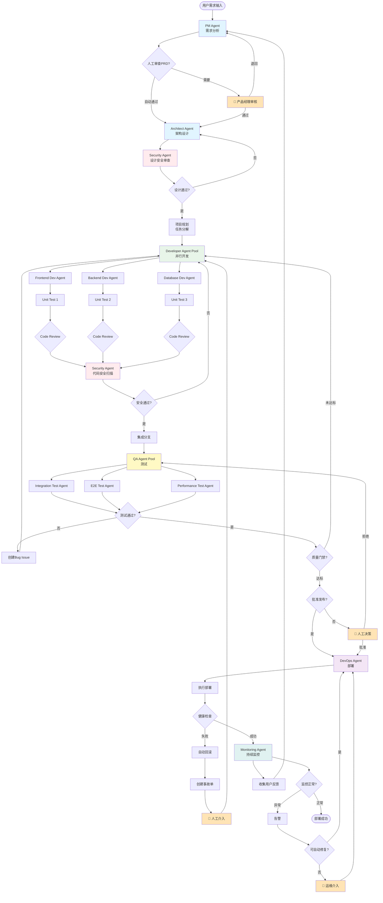

### 1.2 协作时序图

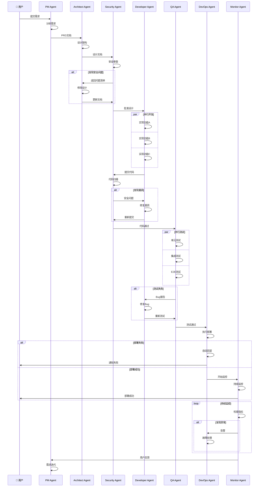

---

## 2. 需求阶段协作流程

### 2.1 PM Agent 需求处理详细流程

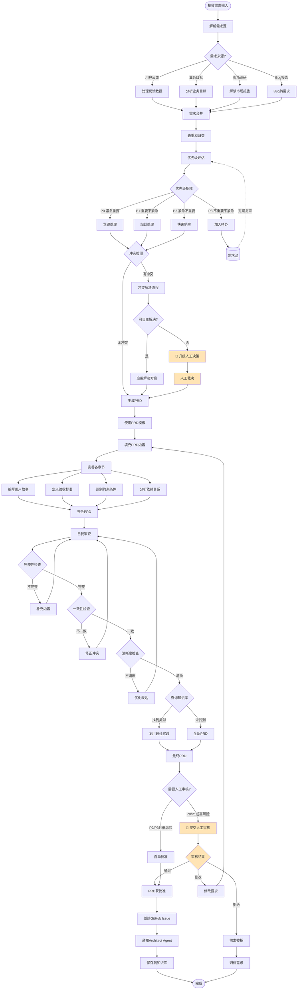

### 2.2 需求优先级矩阵决策

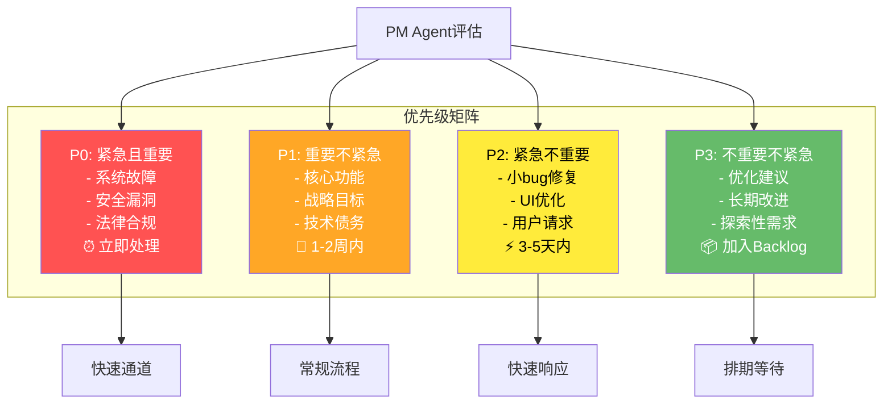

### 2.3 需求冲突解决流程

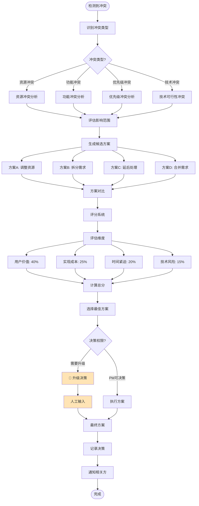

---

## 3. 设计阶段协作流程

### 3.1 Architect Agent 设计流程

```mermaid
flowchart TD
    Start([接收PRD]) --> ParsePRD[解析PRD]
    
    ParsePRD --> Extract[提取关键信息]
    Extract --> FR[功能需求列表]
    Extract --> NFR[非功能需求]
    Extract --> Con[技术约束]
    
    FR --> Analysis[需求分析]
    NFR --> Analysis
    Con --> Analysis
    
    Analysis --> Module[模块划分]
    Module --> Core[识别核心模块]
    Module --> Support[识别支撑模块]
    Module --> Integration[识别集成点]
    
    Core --> TechStack[技术栈选型]
    
    TechStack --> Search{查询知识库}
    Search -->|找到类似| Reuse[复用技术方案]
    Search -->|未找到| Research[技术调研]
    
    Research --> Options[列出候选方案]
    Options --> Compare[方案对比]
    
    Compare --> Criteria[评估标准]
    Criteria --> C1[性能: 25%]
    Criteria --> C2[成本: 20%]
    Criteria --> C3[团队熟悉度: 20%]
    Criteria --> C4[社区支持: 15%]
    Criteria --> C5[可扩展性: 20%]
    
    C1 --> Select[选择最佳方案]
    C2 --> Select
    C3 --> Select
    C4 --> Select
    C5 --> Select
    
    Reuse --> Adapt[适配当前项目]
    Adapt --> Select
    
    Select --> DBDesign[数据库设计]
    
    DBDesign --> Entity[识别实体]
    Entity --> Relation[定义关系]
    Relation --> Schema[设计表结构]
    Schema --> Index[索引策略]
    Index --> Partition{需要分库分表?}
    
    Partition -->|是| Sharding[分片设计]
    Partition -->|否| Cache[缓存设计]
    Sharding --> Cache
    
    Cache --> APIDesign[API设计]
    
    APIDesign --> Endpoints[定义端点]
    Endpoints --> ReqRes[请求响应格式]
    ReqRes --> ErrorHandle[错误处理]
    ErrorHandle --> Version[版本管理]
    Version --> RateLimit[限流策略]
    
    RateLimit --> ArchDoc[生成架构文档]
    
    ArchDoc --> Draw[绘制架构图]
    Draw --> SystemArch[系统架构图]
    Draw --> DataFlow[数据流图]
    Draw --> DeployArch[部署架构图]
    Draw --> ERD[ER图]
    
    SystemArch --> Integrate[整合文档]
    DataFlow --> Integrate
    DeployArch --> Integrate
    ERD --> Integrate
    
    Integrate --> SelfReview[自我审查]
    
    SelfReview --> CheckList{检查清单}
    CheckList --> CK1{完整性?}
    CK1 -->|否| Fix1[补充内容]
    Fix1 --> SelfReview
    
    CK1 -->|是| CK2{一致性?}
    CK2 -->|否| Fix2[修正冲突]
    Fix2 --> SelfReview
    
    CK2 -->|是| CK3{可实现性?}
    CK3 -->|否| Fix3[调整设计]
    Fix3 --> SelfReview
    
    CK3 -->|是| CK4{性能预估?}
    CK4 -->|不满足| Fix4[性能优化]
    Fix4 --> SelfReview
    
    CK4 -->|满足| SecurityReview[提交安全审查]
    
    SecurityReview --> SecAgent[Security Agent审查]
    SecAgent --> SecCheck{安全检查}
    
    SecCheck -->|发现问题| SecIssues[安全问题清单]
    SecIssues --> FixSec[修复安全问题]
    FixSec --> SecurityReview
    
    SecCheck -->|通过| RiskAssess[风险评估]
    
    RiskAssess --> Risk{风险等级?}
    Risk -->|高风险| Human[👤 人工评审]
    Risk -->|中低风险| Auto[自动批准]
    
    Human --> HumanDecision{评审结果}
    HumanDecision -->|通过| Approved[设计批准]
    HumanDecision -->|修改| Revision[修改设计]
    HumanDecision -->|拒绝| Redesign[重新设计]
    
    Revision --> ArchDoc
    Redesign --> TechStack
    
    Auto --> Approved
    
    Approved --> CreateTasks[分解开发任务]
    CreateTasks --> IssueGen[生成GitHub Issues]
    IssueGen --> Assign[分配给Developer Agent]
    Assign --> NotifyTeam[通知开发团队]
    NotifyTeam --> SaveDesign[保存设计文档]
    SaveDesign --> End([完成])

    style Human fill:#FFE4B5
    style HumanDecision fill:#FFE4B5
```

### 3.2 Security Agent 设计审查流程

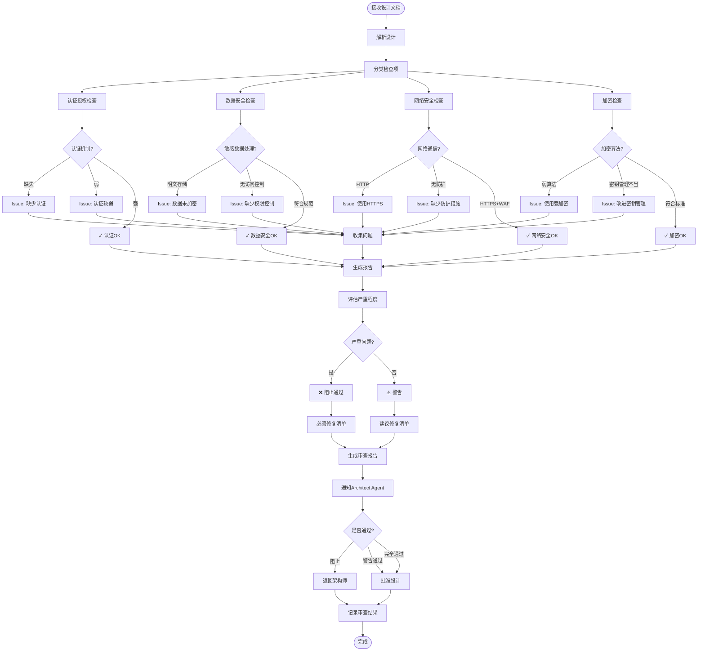

### 3.3 设计阶段协作时序

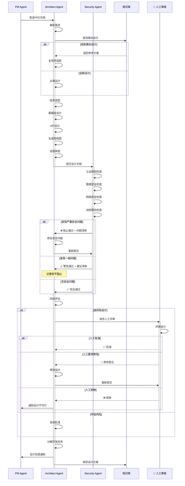

---

## 4. 开发阶段协作流程

### 4.1 Developer Agent Pool 并行开发

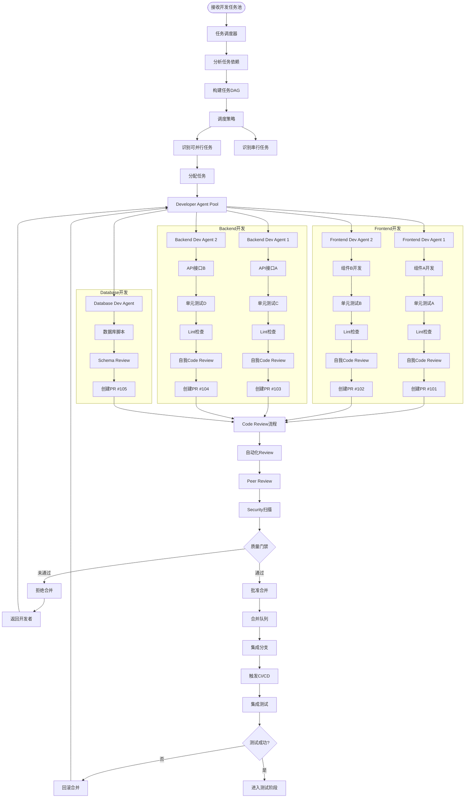

### 4.2 代码审查详细流程

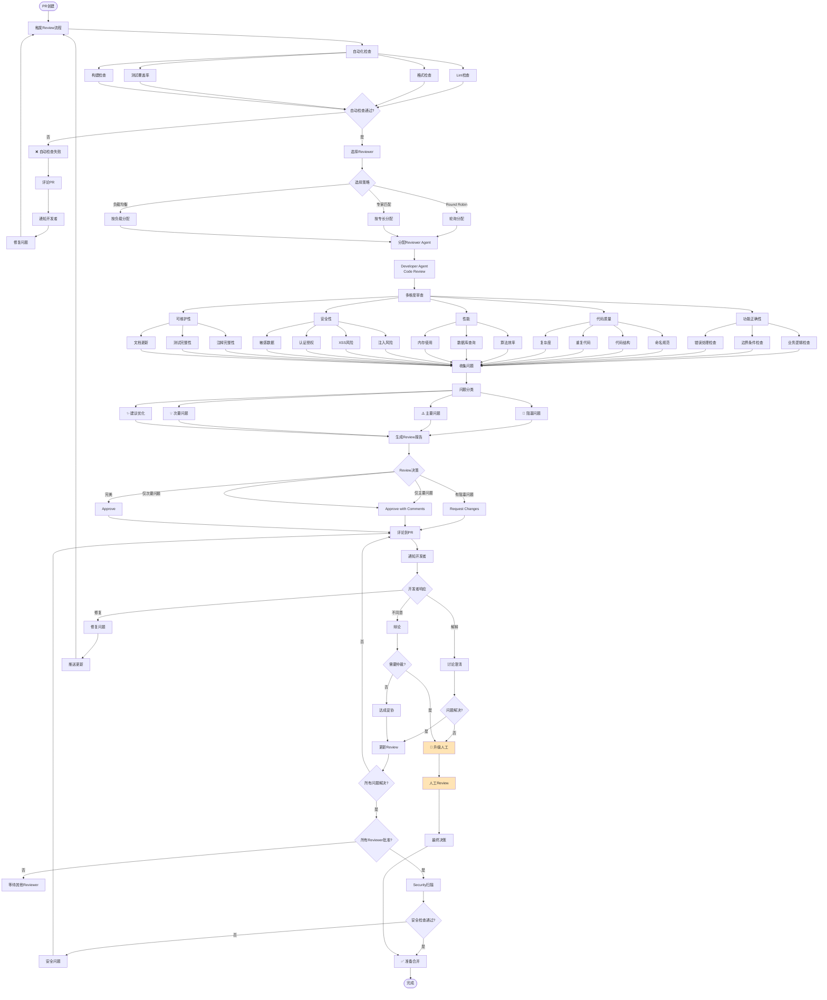

### 4.3 开发阶段时序图

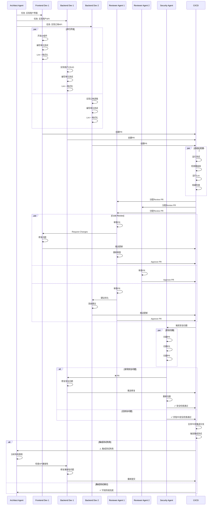

---

## 5. 测试阶段协作流程

### 5.1 QA Agent Pool 测试策略

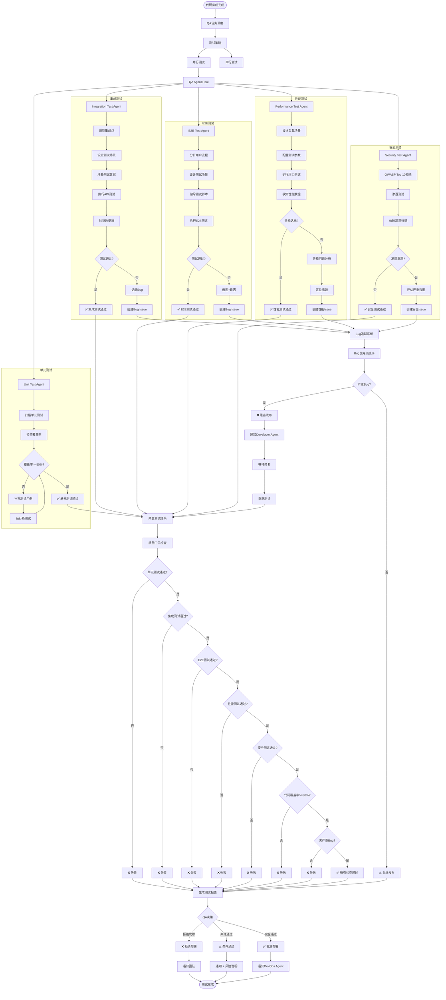

### 5.2 Bug生命周期管理

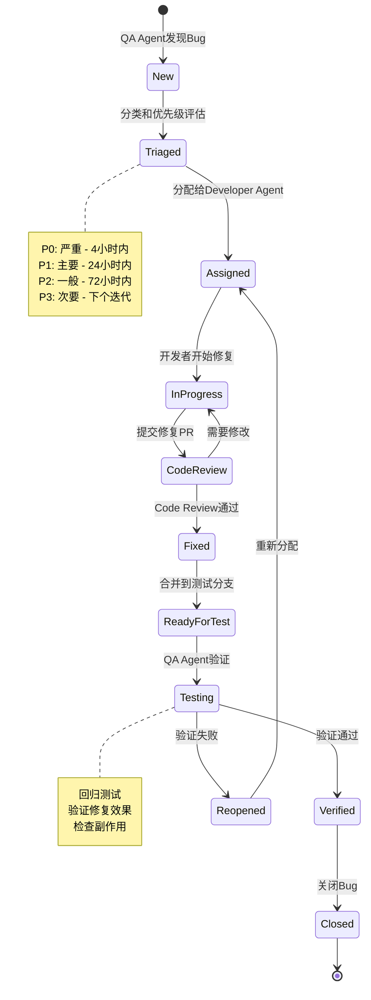

### 5.3 测试阶段协作时序

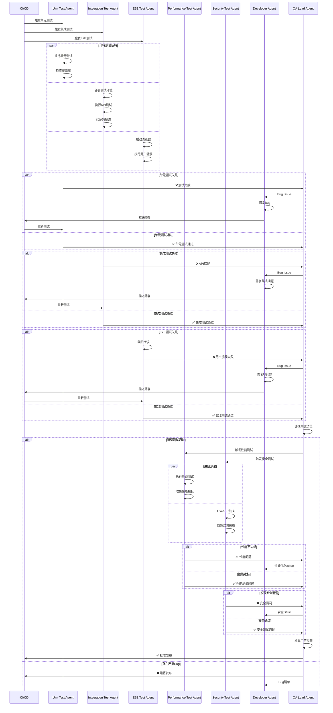

---

## 6. 部署阶段协作流程

### 6.1 DevOps Agent 部署策略选择

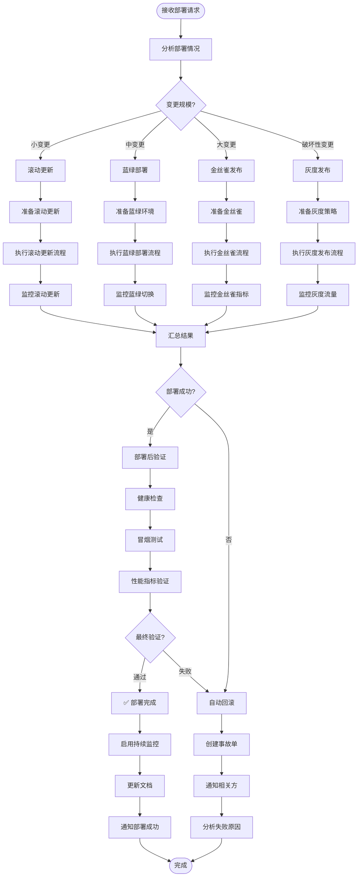

### 6.2 滚动更新详细流程

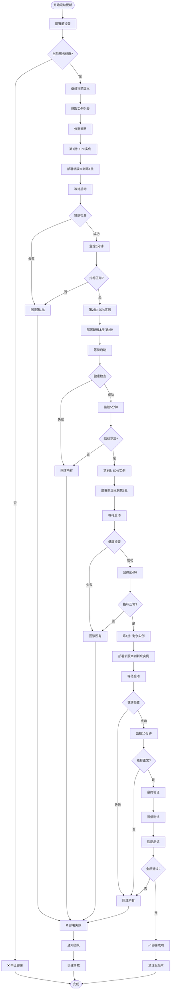

### 6.3 金丝雀发布流程

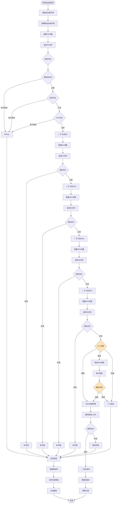

### 6.4 部署阶段协作时序

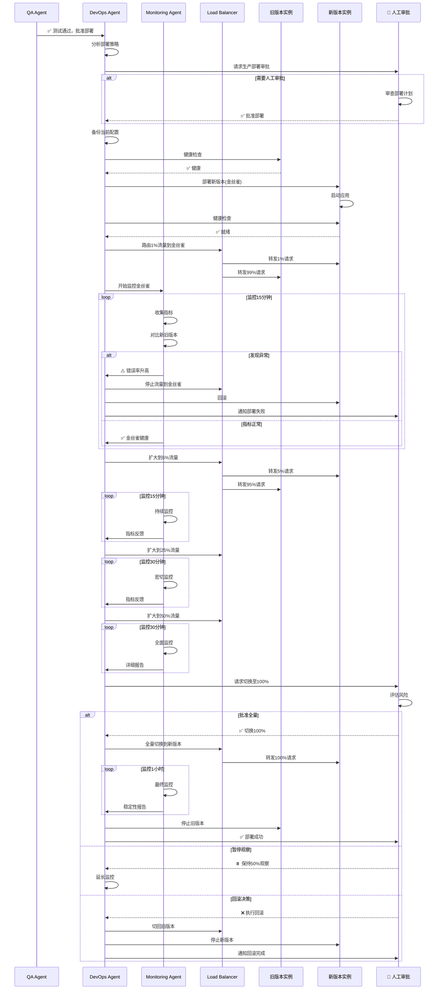

---

## 7. 监控与反馈协作流程

### 7.1 Monitoring Agent 持续监控

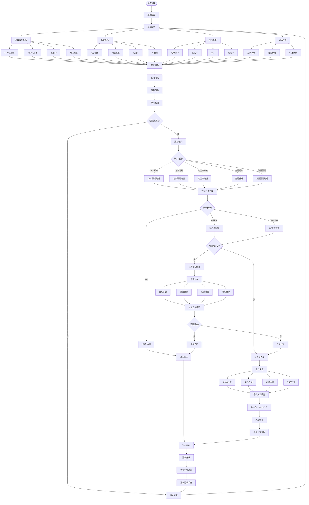

### 7.2 反馈循环流程

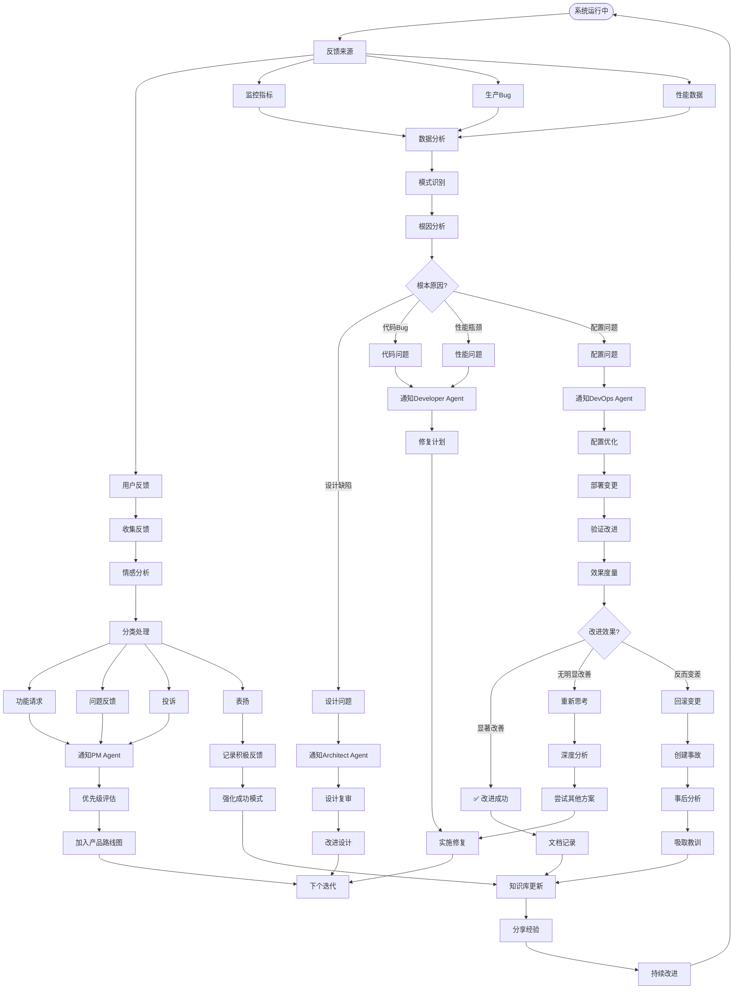

### 7.3 监控告警协作时序

```mermaid
sequenceDiagram
    participant MON as Monitoring Agent
    participant OPS as DevOps Agent
    participant DEV as Developer Agent
    participant PM as PM Agent
    participant H as 👤 运维人员
    participant U as 👤 用户
    
    loop 持续监控
        MON->>MON: 收集指标数据
        MON->>MON: 分析异常
    end
    
    alt 检测到异常
        MON->>MON: 评估严重程度
        
        alt Critical级别
            MON->>OPS: 🚨 严重告警: 错误率90%
            MON->>H: 📱 电话呼叫
            MON->>H: 📧 发送邮件
            
            OPS->>OPS: 自动诊断
            
            alt 可自动修复
                OPS->>OPS: 执行自动扩容
                OPS->>MON: 请求验证
                MON->>MON: 检查指标
                
                alt 问题解决
                    MON->>OPS: ✅ 指标恢复正常
                    OPS->>MON: 记录修复成功
                    MON->>H: 通知问题已自动解决
                    
                else 问题未解决
                    MON->>OPS: ❌ 问题仍存在
                    OPS->>H: 请求人工介入
                    
                    activate H
                    H->>H: 分析日志
                    H->>H: 定位问题
                    H->>OPS: 执行回滚
                    deactivate H
                    
                    OPS->>OPS: 回滚到上一版本
                    OPS->>MON: 验证回滚效果
                    MON->>H: ✅ 回滚成功
                end
                
            else 需要人工处理
                OPS->>H: ⚠️ 无法自动修复
                
                activate H
                H->>H: 紧急诊断
                
                alt 发现代码Bug
                    H->>DEV: 🐛 发现生产Bug
                    activate DEV
                    DEV->>DEV: 紧急修复
                    DEV->>OPS: 提交热修复
                    deactivate DEV
                    
                    OPS->>OPS: 部署热修复
                    OPS->>MON: 验证修复
                    
                else 配置问题
                    H->>OPS: 调整配置
                    OPS->>OPS: 应用新配置
                    OPS->>MON: 验证效果
                end
                
                deactivate H
            end
            
        else Warning级别
            MON->>OPS: ⚠️ 警告: CPU使用率85%
            
            OPS->>OPS: 分析趋势
            
            alt 趋势持续上升
                OPS->>OPS: 预防性扩容
                OPS->>MON: 确认扩容效果
                MON->>OPS: ✅ 指标正常
                
            else 短暂波动
                OPS->>MON: 继续观察
            end
        end
        
        MON->>MON: 记录事件
        MON->>MON: 更新统计数据
    end
    
    loop 收集用户反馈
        U->>PM: 提交功能请求
        PM->>PM: 分析需求
        PM->>PM: 评估优先级
        PM->>MON: 记录用户反馈
    end
    
    MON->>PM: 定期反馈报告
    PM->>PM: 分析反馈趋势
    PM->>DEV: 优化建议
    PM->>OPS: 性能改进需求
```

---

## 8. 特殊场景协作流程

### 8.1 紧急Bug修复流程

```mermaid
flowchart TD
    Start([生产环境发现严重Bug]) --> Report[Bug报告]
    
    Report --> MON[Monitoring Agent检测]
    Report --> USER[用户报告]
    
    MON --> Classify[分类评估]
    USER --> Classify
    
    Classify --> Severity{严重程度?}
    
    Severity -->|P0 系统崩溃| Emergency[🚨 紧急响应]
    Severity -->|P1 功能失效| Urgent[⚡ 紧急处理]
    Severity -->|P2 影响使用| Normal[📋 常规流程]
    
    Emergency --> OncallNotify[👤 通知On-call]
    Emergency --> AutoAction[自动应急措施]
    
    AutoAction --> Rollback[尝试自动回滚]
    AutoAction --> TrafficControl[流量控制]
    AutoAction --> ServiceDegrade[服务降级]
    
    Rollback --> StabilizeCheck{系统稳定?}
    TrafficControl --> StabilizeCheck
    ServiceDegrade --> StabilizeCheck
    
    StabilizeCheck -->|是| Stabilized[✅ 系统稳定]
    StabilizeCheck -->|否| EscalateTeam[👤 升级团队]
    
    OncallNotify --> InvestigateImmediate[立即调查]
    EscalateTeam --> InvestigateImmediate
    
    InvestigateImmediate --> Logs[分析日志]
    InvestigateImmediate --> Monitoring[检查监控]
    InvestigateImmediate --> ReproduceIssue[尝试复现]
    
    Logs --> RootCause[定位根因]
    Monitoring --> RootCause
    ReproduceIssue --> RootCause
    
    RootCause --> QuickFix{可快速修复?}
    
    QuickFix -->|是| HotfixBranch[创建Hotfix分支]
    QuickFix -->|否| Workaround[寻找临时方案]
    
    HotfixBranch --> DevFix[Developer Agent修复]
    DevFix --> QuickTest[快速测试]
    QuickTest --> TestPass{测试通过?}
    
    TestPass -->|否| DevFix
    TestPass -->|是| SecScan[安全快速扫描]
    
    SecScan --> SecOK{安全通过?}
    SecOK -->|否| DevFix
    SecOK -->|是| ApprovalRequest[👤 请求紧急审批]
    
    ApprovalRequest --> Approval{审批结果?}
    Approval -->|批准| EmergencyDeploy[紧急部署]
    Approval -->|拒绝| Alternative[寻找替代方案]
    
    EmergencyDeploy --> DeployCanary[部署到金丝雀]
    DeployCanary --> QuickVerify[快速验证]
    QuickVerify --> VerifyOK{验证通过?}
    
    VerifyOK -->|否| EmergencyRollback[紧急回滚]
    VerifyOK -->|是| FullDeploy[全量部署]
    
    FullDeploy --> MonitorClosely[密切监控]
    MonitorClosely --> FinalCheck{问题解决?}
    
    FinalCheck -->|是| Resolved[✅ Bug已解决]
    FinalCheck -->|否| EmergencyRollback
    
    Workaround --> TempSolution[实施临时方案]
    TempSolution --> PlanFix[计划完整修复]
    Alternative --> PlanFix
    
    EmergencyRollback --> Incident[创建严重事故]
    Incident --> WarRoom[👤 战情室会议]
    WarRoom --> TeamFix[团队协作修复]
    TeamFix --> DevFix
    
    Resolved --> PostMortem[事后分析]
    Stabilized --> PostMortem
    
    PostMortem --> Timeline[重建时间线]
    PostMortem --> Impact[评估影响]
    PostMortem --> Prevention[预防措施]
    
    Timeline --> Document[文档记录]
    Impact --> Document
    Prevention --> Document
    
    Document --> Share[分享学习]
    Share --> UpdateProcess[更新流程]
    UpdateProcess --> KB[更新知识库]
    KB --> End([完成])
    
    Urgent --> StandardHotfix[标准热修复流程]
    StandardHotfix --> HotfixBranch
    
    Normal --> StandardBugfix[标准Bug修复流程]
    StandardBugfix --> DevFix

    style OncallNotify fill:#FFE4B5
    style EscalateTeam fill:#FFE4B5
    style ApprovalRequest fill:#FFE4B5
    style WarRoom fill:#FFE4B5
```

### 8.2 技术债务处理流程

```mermaid
flowchart TD
    Start([识别技术债务]) --> Sources[债务来源]
    
    Sources --> CodeReview[Code Review发现]
    Sources --> Performance[性能问题]
    Sources --> Security[安全漏洞]
    Sources --> Maintenance[维护困难]
    
    CodeReview --> Collect[收集债务清单]
    Performance --> Collect
    Security --> Collect
    Maintenance --> Collect
    
    Collect --> Categorize[分类债务]
    
    Categorize --> Type{债务类型?}
    
    Type -->|代码质量| Quality[代码质量债务]
    Type -->|架构问题| Architecture[架构债务]
    Type -->|测试缺失| Testing[测试债务]
    Type -->|文档缺失| Documentation[文档债务]
    Type -->|技术栈过时| Technology[技术栈债务]
    
    Quality --> Assess[评估债务]
    Architecture --> Assess
    Testing --> Assess
    Documentation --> Assess
    Technology --> Assess
    
    Assess --> Impact[影响分析]
    Impact --> I1[当前影响]
    Impact --> I2[未来风险]
    Impact --> I3[修复成本]
    Impact --> I4[维护成本]
    
    I1 --> Score[债务评分]
    I2 --> Score
    I3 --> Score
    I4 --> Score
    
    Score --> Priority[优先级排序]
    
    Priority --> Matrix{优先级矩阵}
    Matrix -->|高影响+低成本| Quick[快速解决]
    Matrix -->|高影响+高成本| Plan[规划解决]
    Matrix -->|低影响+低成本| Backlog[加入待办]
    Matrix -->|低影响+高成本| Monitor[监控观察]
    
    Quick --> Assign1[分配给Developer Agent]
    Plan --> Arch[Architect Agent设计]
    
    Arch --> RefactorPlan[重构计划]
    RefactorPlan --> Phases[分阶段实施]
    
    Phases --> Phase1[阶段1: 准备]
    Phases --> Phase2[阶段2: 重构]
    Phases --> Phase3[阶段3: 验证]
    
    Phase1 --> Prep1[编写测试]
    Phase1 --> Prep2[建立基准]
    Phase1 --> Prep3[创建分支]
    
    Prep1 --> Phase2Start[开始重构]
    Prep2 --> Phase2Start
    Prep3 --> Phase2Start
    
    Phase2Start --> Refactor[执行重构]
    Refactor --> Tests[运行测试]
    Tests --> TestsPass{测试通过?}
    
    TestsPass -->|否| FixTests[修复问题]
    FixTests --> Refactor
    
    TestsPass -->|是| Phase3Start[验证阶段]
    
    Phase3Start --> Performance [性能测试]
    Phase3Start --> Security[安全测试]
    Phase3Start --> Integration[集成测试]
    
    Performance --> Results[汇总结果]
    Security --> Results
    Integration --> Results
    
    Results --> Improved{是否改善?}
    Improved -->|是| Merge[合并代码]
    Improved -->|否| Analyze[分析原因]
    
    Analyze --> Adjust[调整方案]
    Adjust --> Refactor
    
    Merge --> Deploy[渐进式部署]
    Deploy --> Monitor2[监控验证]
    Monitor2 --> Success{成功?}
    
    Success -->|是| Complete[✅ 债务解决]
    Success -->|否| Rollback[回滚]
    Rollback --> ReplanPhase[重新规划]
    ReplanPhase --> Phase2Start
    
    Assign1 --> QuickFix[快速修复]
    QuickFix --> TestFix[测试修复]
    TestFix --> Review[Code Review]
    Review --> Merge
    
    Complete --> Document[更新文档]
    Document --> KB[知识库记录]
    KB --> Metrics[更新债务指标]
    
    Backlog --> DebtBacklog[(技术债务池)]
    Monitor --> Periodic[定期复审]
    Periodic --> Reassess[重新评估]
    Reassess --> Priority
    
    Metrics --> Report[生成报告]
    Report --> Stakeholders[通知干系人]
    Stakeholders --> End([完成])
```

### 8.3 跨Agent协作冲突解决

```mermaid
flowchart TD
    Start([检测到协作冲突]) --> Identify[识别冲突]
    
    Identify --> Type{冲突类型?}
    
    Type -->|需求冲突| PM_ARCH[PM vs Architect]
    Type -->|设计冲突| ARCH_DEV[Architect vs Developer]
    Type -->|质量冲突| DEV_QA[Developer vs QA]
    Type -->|部署冲突| QA_OPS[QA vs DevOps]
    
    PM_ARCH --> PMARCHIssue[需求vs技术可行性]
    PMARCHIssue --> PMARCHData[收集数据]
    
    PMARCHData --> PMView[PM观点: 业务价值]
    PMARCHData --> ArchView[Architect观点: 技术风险]
    
    PMView --> Negotiate1[协商机制]
    ArchView --> Negotiate1
    
    Negotiate1 --> Option1[方案A: 简化需求]
    Negotiate1 --> Option2[方案B: 分阶段实现]
    Negotiate1 --> Option3[方案C: 技术攻关]
    
    Option1 --> Evaluate1[评估方案]
    Option2 --> Evaluate1
    Option3 --> Evaluate1
    
    Evaluate1 --> CanResolve1{Agent可决策?}
    CanResolve1 -->|是| Execute1[执行方案]
    CanResolve1 -->|否| Escalate1[👤 升级产品总监]
    
    ARCH_DEV --> ARCHDEVIssue[设计vs实现]
    ARCHDEVIssue --> ARCHDEVData[分析差异]
    
    ARCHDEVData --> ArchReason[架构师理由]
    ARCHDEVData --> DevConcern[开发者顾虑]
    
    ArchReason --> TechReview[技术评审]
    DevConcern --> TechReview
    
    TechReview --> ArchCorrect{设计是否合理?}
    ArchCorrect -->|是| DevAdapt[Developer适配]
    ArchCorrect -->|否| ArchModify[Architect修改]
    ArchCorrect -->|不确定| Prototype[快速原型验证]
    
    Prototype --> ProtoResult{原型结果?}
    ProtoResult -->|支持设计| DevAdapt
    ProtoResult -->|反对设计| ArchModify
    
    DevAdapt --> Execute2[执行实现]
    ArchModify --> ReDesign[重新设计]
    ReDesign --> Execute2
    
    DEV_QA --> DEVQAIssue[代码vs质量]
    DEVQAIssue --> DEVQAData[分析问题]
    
    DEVQAData --> BugReport[Bug报告]
    DEVQAData --> DevResponse[Developer回应]
    
    BugReport --> Verify[验证Bug]
    Verify --> RealBug{确实是Bug?}
    
    RealBug -->|是| DevFix[Developer修复]
    RealBug -->|否| QAMisunderstand[QA误解]
    RealBug -->|需澄清| Clarify[需求澄清]
    
    DevFix --> Retest[重新测试]
    Retest --> Execute3[继续流程]
    
    QAMisunderstand --> QAUpdate[QA更新理解]
    QAUpdate --> Execute3
    
    Clarify --> PM[请PM Agent澄清]
    PM --> ClarifyDoc[更新需求文档]
    ClarifyDoc --> Execute3
    
    QA_OPS --> QAOPSIssue[测试vs部署]
    QAOPSIssue --> QAOPSData[分析原因]
    
    QAOPSData --> QABlock{QA阻止部署?}
    
    QABlock -->|严重Bug| Justified[正当阻止]
    QABlock -->|小问题| Debate[争论]
    QABlock -->|误判| Override[DevOps覆盖]
    
    Justified --> MustFix[必须修复]
    MustFix --> DevFix
    
    Debate --> RiskAssess[风险评估]
    RiskAssess --> Acceptable{风险可接受?}
    Acceptable -->|是| Proceed[继续部署+监控]
    Acceptable -->|否| MustFix
    Acceptable -->|不确定| HumanDecision[👤 人工决策]
    
    Override --> QAReview[QA复查]
    QAReview --> QARight{QA是否正确?}
    QARight -->|是| Apologize[DevOps撤回]
    QARight -->|否| ProceedDeploy[继续部署]
    
    HumanDecision --> FinalCall[最终决策]
    FinalCall --> Execute4[执行决策]
    
    Execute1 --> Document1[记录决策]
    Execute2 --> Document1
    Execute3 --> Document1
    Execute4 --> Document1
    Proceed --> Document1
    ProceedDeploy --> Document1
    Apologize --> Document1
    
    Escalate1 --> HumanMediation[人工调解]
    HumanMediation --> Document1
    
    Document1 --> Learn[学习改进]
    Learn --> UpdateProtocol[更新协作协议]
    UpdateProtocol --> KBRecord[知识库记录]
    KBRecord --> End([完成])

    style Escalate1 fill:#FFE4B5
    style HumanDecision fill:#FFE4B5
    style FinalCall fill:#FFE4B5
    style HumanMediation fill:#FFE4B5
```

---

## 9. 人机协作决策点

### 9.1 决策点分布图

```mermaid
graph TB
    subgraph "需求阶段决策点"
        D1[👤 审批PRD<br/>P0/P1需求]
        D2[👤 冲突裁决<br/>无法自动解决]
    end
    
    subgraph "设计阶段决策点"
        D3[👤 审查架构<br/>高风险设计]
        D4[👤 批准技术选型<br/>核心技术变更]
        D5[👤 安全例外<br/>特殊安全需求]
    end
    
    subgraph "开发阶段决策点"
        D6[👤 Code Review<br/>关键代码变更]
        D7[👤 API变更审批<br/>公共接口修改]
        D8[👤 引入新依赖<br/>重要库引入]
    end
    
    subgraph "测试阶段决策点"
        D9[👤 质量例外<br/>质量不达标时]
        D10[👤 发布决策<br/>条件性通过]
    end
    
    subgraph "部署阶段决策点"
        D11[👤 生产部署批准<br/>所有生产发布]
        D12[👤 金丝雀决策<br/>50%流量时]
        D13[👤 回滚决策<br/>严重问题时]
    end
    
    subgraph "运维阶段决策点"
        D14[👤 紧急事故响应<br/>P0事故]
        D15[👤 资源扩容审批<br/>大规模扩容]
        D16[👤 架构调整<br/>基础设施变更]
    end
    
    PM[PM Agent] -.触发.-> D1
    PM -.触发.-> D2
    
    ARCH[Architect Agent] -.触发.-> D3
    ARCH -.触发.-> D4
    SEC[Security Agent] -.触发.-> D5
    
    DEV[Developer Agent] -.触发.-> D6
    DEV -.触发.-> D7
    DEV -.触发.-> D8
    
    QA[QA Agent] -.触发.-> D9
    QA -.触发.-> D10
    
    OPS[DevOps Agent] -.触发.-> D11
    OPS -.触发.-> D12
    OPS -.触发.-> D13
    
    MON[Monitoring Agent] -.触发.-> D14
    OPS -.触发.-> D15
    OPS -.触发.-> D16
    
    style D1 fill:#FFE4B5
    style D2 fill:#FFE4B5
    style D3 fill:#FFE4B5
    style D4 fill:#FFE4B5
    style D5 fill:#FFE4B5
    style D6 fill:#FFE4B5
    style D7 fill:#FFE4B5
    style D8 fill:#FFE4B5
    style D9 fill:#FFE4B5
    style D10 fill:#FFE4B5
    style D11 fill:#FFE4B5
    style D12 fill:#FFE4B5
    style D13 fill:#FFE4B5
    style D14 fill:#FFE4B5
    style D15 fill:#FFE4B5
    style D16 fill:#FFE4B5
```

### 9.2 人工介入触发条件

```mermaid
flowchart TD
    Start([Agent执行任务]) --> Monitor[监控执行状态]
    
    Monitor --> CheckTriggers{检查触发条件}
    
    CheckTriggers --> T1{决策权限<br/>超出范围?}
    CheckTriggers --> T2{风险评估<br/>高风险?}
    CheckTriggers --> T3{质量不达标<br/>且无方案?}
    CheckTriggers --> T4{连续失败<br/>3次以上?}
    CheckTriggers --> T5{Agent冲突<br/>无法协商?}
    CheckTriggers --> T6{紧急事故<br/>P0级别?}
    
    T1 -->|是| Trigger[触发人工介入]
    T2 -->|是| Trigger
    T3 -->|是| Trigger
    T4 -->|是| Trigger
    T5 -->|是| Trigger
    T6 -->|是| Trigger
    
    T1 -->|否| Continue
    T2 -->|否| Continue
    T3 -->|否| Continue
    T4 -->|否| Continue
    T5 -->|否| Continue
    T6 -->|否| Continue[继续自动化]
    
    Trigger --> Prepare[准备介入材料]
    
    Prepare --> Context[上下文信息]
    Prepare --> Problem[问题描述]
    Prepare --> Options[候选方案]
    Prepare --> Recommendation[Agent建议]
    
    Context --> Package[打包信息]
    Problem --> Package
    Options --> Package
    Recommendation --> Package
    
    Package --> Notify[通知人工]
    
    Notify --> Channel{通知渠道}
    Channel --> Slack[Slack消息]
    Channel --> Email[邮件]
    Channel --> Dashboard[Dashboard]
    Channel --> Phone[电话 - 紧急]
    
    Slack --> WaitResponse[等待响应]
    Email --> WaitResponse
    Dashboard --> WaitResponse
    Phone --> WaitResponse
    
    WaitResponse --> Response{响应类型?}
    
    Response -->|批准| ApproveAction[执行Agent建议]
    Response -->|修改| ModifyAction[修改后执行]
    Response -->|拒绝| RejectAction[停止执行]
    Response -->|委派| DelegateAction[委派其他人]
    
    ApproveAction --> Execute[执行动作]
    ModifyAction --> Execute
    RejectAction --> Archive[归档任务]
    DelegateAction --> ReNotify[重新通知]
    ReNotify --> WaitResponse
    
    Execute --> Result[记录结果]
    Archive --> Result
    
    Result --> Learn[Agent学习]
    Learn --> UpdateRules[更新规则]
    UpdateRules --> End([完成])
    
    Continue --> End
```

---

## 10. 并行协作模式

### 10.1 多项目并行协作

```mermaid
flowchart TB
    Start([多个项目启动]) --> Dispatcher[项目调度器]
    
    Dispatcher --> P1[项目A: 电商平台]
    Dispatcher --> P2[项目B: 支付系统]
    Dispatcher --> P3[项目C: 数据分析]
    
    subgraph "项目A - 电商平台"
        P1 --> PM1[PM Agent 1]
        PM1 --> ARCH1[Architect Agent 1]
        ARCH1 --> DEV_POOL1[Dev Pool A]
        DEV_POOL1 --> DEV1A[Frontend Dev A1]
        DEV_POOL1 --> DEV1B[Backend Dev A1]
        DEV_POOL1 --> DEV1C[Backend Dev A2]
    end
    
    subgraph "项目B - 支付系统"
        P2 --> PM2[PM Agent 2]
        PM2 --> ARCH2[Architect Agent 2]
        ARCH2 --> DEV_POOL2[Dev Pool B]
        DEV_POOL2 --> DEV2A[Backend Dev B1]
        DEV_POOL2 --> DEV2B[Backend Dev B2]
    end
    
    subgraph "项目C - 数据分析"
        P3 --> PM3[PM Agent 3]
        PM3 --> ARCH1
        ARCH1 --> DEV_POOL3[Dev Pool C]
        DEV_POOL3 --> DEV3A[Data Dev C1]
        DEV_POOL3 --> DEV3B[Data Dev C2]
    end
    
    subgraph "共享资源池"
        SHARED[Shared Agent Pool]
        SHARED --> QA_POOL[QA Agent Pool<br/>4个Agent]
        SHARED --> SEC_AGENT[Security Agent<br/>全局共享]
        SHARED --> OPS_AGENT[DevOps Agent<br/>2个Agent]
        SHARED --> MON_AGENT[Monitoring Agent<br/>全局监控]
    end
    
    DEV1A --> QA_POOL
    DEV1B --> QA_POOL
    DEV1C --> QA_POOL
    DEV2A --> QA_POOL
    DEV2B --> QA_POOL
    DEV3A --> QA_POOL
    DEV3B --> QA_POOL
    
    QA_POOL --> SEC_AGENT
    SEC_AGENT --> OPS_AGENT
    OPS_AGENT --> MON_AGENT
    
    subgraph "负载均衡"
        LB[Load Balancer]
        LB --> Priority[优先级队列]
        Priority --> P0_Queue[P0队列]
        Priority --> P1_Queue[P1队列]
        Priority --> P2_Queue[P2队列]
    end
    
    PM1 -.提交任务.-> LB
    PM2 -.提交任务.-> LB
    PM3 -.提交任务.-> LB
    
    P0_Queue -.分配.-> SHARED
    P1_Queue -.分配.-> SHARED
    P2_Queue -.分配.-> SHARED
```

### 10.2 Agent资源调度策略

```mermaid
flowchart TD
    Start([接收任务请求]) --> Parse[解析任务]
    
    Parse --> Extract[提取信息]
    Extract --> Priority[优先级]
    Extract --> Type[任务类型]
    Extract --> Estimated[预估工作量]
    Extract --> Deadline[截止时间]
    
    Priority --> Schedule[调度决策]
    Type --> Schedule
    Estimated --> Schedule
    Deadline --> Schedule
    
    Schedule --> Strategy{调度策略?}
    
    Strategy -->|FIFO| FirstInFirstOut[先进先出]
    Strategy -->|Priority| PriorityBased[优先级优先]
    Strategy -->|Deadline| EarliestDeadline[最早截止优先]
    Strategy -->|LoadBalance| LoadBalancing[负载均衡]
    
    FirstInFirstOut --> AssignAgent[分配Agent]
    PriorityBased --> AssignAgent
    EarliestDeadline --> AssignAgent
    LoadBalancing --> AssignAgent
    
    AssignAgent --> Pool[Agent资源池]
    
    Pool --> CheckAvail{检查可用性}
    
    CheckAvail --> Available{有空闲Agent?}
    Available -->|是| SelectAgent[选择Agent]
    Available -->|否| Queue[加入等待队列]
    
    Queue --> WaitStrategy{等待策略?}
    WaitStrategy -->|阻塞| BlockWait[阻塞等待]
    WaitStrategy -->|抢占| Preempt[抢占低优先级]
    WaitStrategy -->|扩容| ScaleOut[动态扩容]
    
    BlockWait --> PeriodCheck[定期检查]
    PeriodCheck --> CheckAvail
    
    Preempt --> FindVictim[找到被抢占任务]
    FindVictim --> Suspend[暂停低优先级任务]
    Suspend --> SelectAgent
    
    ScaleOut --> CreateAgent[创建新Agent实例]
    CreateAgent --> AddPool[加入资源池]
    AddPool --> SelectAgent
    
    SelectAgent --> Assign[分配任务给Agent]
    Assign --> Execute[Agent执行任务]
    
    Execute --> Monitor[监控执行]
    Monitor --> Status{执行状态?}
    
    Status -->|进行中| Continue[继续执行]
    Status -->|完成| Release[释放Agent]
    Status -->|失败| Retry[重试机制]
    
    Continue --> Monitor
    
    Retry --> Count{重试次数?}
    Count -->|<3次| Reassign[重新分配Agent]
    Count -->|>=3次| Escalate[升级人工处理]
    
    Reassign --> AssignAgent
    Escalate --> HumanIntervene[👤 人工介入]
    
    Release --> UpdateMetrics[更新指标]
    UpdateMetrics --> CheckQueue{队列有任务?}
    
    CheckQueue -->|是| AssignNext[分配下一任务]
    CheckQueue -->|否| Idle[Agent空闲]
    
    AssignNext --> SelectAgent
    
    Idle --> IdleTimeout{空闲超时?}
    IdleTimeout -->|是| ScaleIn[缩容]
    IdleTimeout -->|否| Wait[等待新任务]
    
    ScaleIn --> RemoveAgent[移除Agent]
    RemoveAgent --> End([完成])
    
    Wait --> CheckAvail
    HumanIntervene --> End

    style HumanIntervene fill:#FFE4B5
```

---

## 总结

本文档详细展示了AI Agent团队在软件开发全生命周期中的协作流程，包括：

### ✅ 覆盖的协作场景

1. **完整开发周期** - 从需求到部署的端到端流程
2. **各阶段详细流程** - 需求、设计、开发、测试、部署、监控
3. **特殊场景** - 紧急Bug、技术债务、Agent冲突
4. **人机协作** - 16个关键决策点
5. **并行协作** - 多项目资源调度

### 📊 流程图特点

- **50+ Mermaid流程图** - 可视化展示
- **时序图** - 展示Agent间交互
- **状态图** - 展示状态转换
- **决策树** - 展示决策逻辑
- **系统图** - 展示整体架构

### 🎯 实用价值

这些流程图可以用于：
- Agent系统设计参考
- 开发团队培训
- 流程优化分析
- 问题诊断定位
- 自动化实施指导

---

**文档版本**: v1.0.0  
**创建日期**: 2025-01-20  
**配套文档**: agent-roles-definition.md  
**维护团队**: AI Agent 开发团队