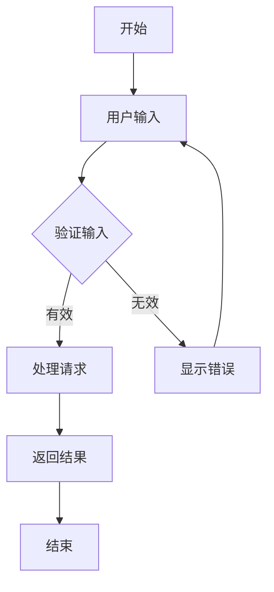

# 功能需求子模块 - [模块名称]

## 返回主需求
← [返回主PRD文档](./prd-template.md)

---

## 1. 模块概要

### 1.1 模块信息
| 字段 | 值 |
|------|----|
| 模块名称 | [模块名称] |
| 模块编号 | [MOD-XXX] |
| 负责人 | [负责人姓名] |
| 创建日期 | [YYYY-MM-DD] |
| 最后修改日期 | [YYYY-MM-DD] |
| 版本 | [1.0.0] |
| 状态 | [开发中/已完成/待审核] |

### 1.2 模块描述
[模块的整体描述，包括模块的主要目的、作用域和核心功能概述]

### 1.3 模块依赖
- **前置模块**: [依赖的其他模块]
- **后续模块**: [依赖本模块的其他模块]
- **外部依赖**: [第三方服务或系统依赖]

### 1.4 业务价值
- [业务价值点1]
- [业务价值点2]
- [业务价值点3]

---

## 2. 修改履历

| 版本 | 日期 | 修改人 | 修改内容 | 影响范围 |
|------|------|--------|----------|----------|
| 1.0.0 | [YYYY-MM-DD] | [姓名] | 初始版本创建 | 全部 |
| 1.0.1 | [YYYY-MM-DD] | [姓名] | [具体修改内容] | [影响的功能编号] |
| 1.0.2 | [YYYY-MM-DD] | [姓名] | [具体修改内容] | [影响的功能编号] |

---

## 3. 功能列表

### 3.1 功能概览
| 功能编号 | 功能名称 | 优先级 | 复杂度 | 状态 | 负责人 |
|----------|----------|--------|--------|------|--------|
| F-001 | [功能名称1] | 高 | 中 | 开发中 | [姓名] |
| F-002 | [功能名称2] | 中 | 低 | 待开发 | [姓名] |
| F-003 | [功能名称3] | 高 | 高 | 已完成 | [姓名] |

### 3.2 功能分类
#### 3.2.1 核心功能
- **F-001**: [功能名称1] - [简要描述]
- **F-002**: [功能名称2] - [简要描述]

#### 3.2.2 辅助功能
- **F-003**: [功能名称3] - [简要描述]
- **F-004**: [功能名称4] - [简要描述]

#### 3.2.3 管理功能
- **F-005**: [功能名称5] - [简要描述]
- **F-006**: [功能名称6] - [简要描述]

---

## 4. 功能详细说明

### 4.1 功能 F-001: [功能名称1]

#### 4.1.1 基本信息
| 属性 | 值 |
|------|-----|
| 功能编号 | F-001 |
| 功能名称 | [功能名称1] |
| 优先级 | 高/中/低 |
| 复杂度 | 高/中/低 |
| 预估工作量 | [人天] |
| 负责人 | [姓名] |
| 关联需求 | [主PRD中的需求编号] |

#### 4.1.2 功能描述
[功能的详细描述，包括功能的目的、使用场景、预期效果等]

#### 4.1.3 用户故事
**作为** [用户角色]  
**我想要** [功能需求]  
**以便** [业务价值]

#### 4.1.4 验收标准
- [ ] [验收标准1]
- [ ] [验收标准2]
- [ ] [验收标准3]

#### 4.1.5 功能流程

#### 4.1.6 输入输出
**输入**:
- 输入参数1: [类型] - [描述]
- 输入参数2: [类型] - [描述]

**输出**:
- 输出结果1: [类型] - [描述]
- 输出结果2: [类型] - [描述]

#### 4.1.7 业务规则
- **BR-F001-001**: [业务规则描述]
- **BR-F001-002**: [业务规则描述]

#### 4.1.8 异常处理
| 异常编号 | 异常情况 | 处理方式 | 用户提示 |
|----------|----------|----------|----------|
| E-F001-001 | [异常情况] | [系统处理] | [用户看到的消息] |
| E-F001-002 | [异常情况] | [系统处理] | [用户看到的消息] |

#### 4.1.9 界面原型
[界面设计图链接或描述]

#### 4.1.10 技术实现要点
- [技术要点1]
- [技术要点2]
- [技术要点3]

---

### 4.2 功能 F-002: [功能名称2]

#### 4.2.1 基本信息
| 属性 | 值 |
|------|-----|
| 功能编号 | F-002 |
| 功能名称 | [功能名称2] |
| 优先级 | 高/中/低 |
| 复杂度 | 高/中/低 |
| 预估工作量 | [人天] |
| 负责人 | [姓名] |
| 关联需求 | [主PRD中的需求编号] |

#### 4.2.2 功能描述
[功能的详细描述]

#### 4.2.3 用户故事
**作为** [用户角色]  
**我想要** [功能需求]  
**以便** [业务价值]

#### 4.2.4 验收标准
- [ ] [验收标准1]
- [ ] [验收标准2]
- [ ] [验收标准3]

#### 4.2.5 功能流程
[流程图或文字描述]

#### 4.2.6 输入输出
**输入**:
- [输入描述]

**输出**:
- [输出描述]

#### 4.2.7 业务规则
- **BR-F002-001**: [业务规则描述]

#### 4.2.8 异常处理
| 异常编号 | 异常情况 | 处理方式 | 用户提示 |
|----------|----------|----------|----------|
| E-F002-001 | [异常情况] | [系统处理] | [用户看到的消息] |

#### 4.2.9 界面原型
[界面设计图链接或描述]

#### 4.2.10 技术实现要点
- [技术要点1]
- [技术要点2]

---

### 4.3 功能 F-003: [功能名称3]

[重复上述结构，为每个功能提供详细说明]

---

## 5. 模块集成

### 5.1 接口定义
| 接口编号 | 接口名称 | 接口类型 | 调用方 | 提供方 |
|----------|----------|----------|--------|--------|
| API-001 | [接口名称] | REST API | [调用模块] | [本模块] |
| API-002 | [接口名称] | 消息队列 | [本模块] | [外部系统] |

### 5.2 数据交互
- **输入数据**: [数据来源和格式]
- **输出数据**: [数据去向和格式]
- **共享数据**: [与其他模块共享的数据]

---

## 6. 测试计划

### 6.1 测试策略
- **单元测试**: [覆盖所有功能点]
- **集成测试**: [与相关模块的集成]
- **端到端测试**: [完整业务流程]

### 6.2 测试用例
| 测试编号 | 功能编号 | 测试场景 | 预期结果 | 状态 |
|----------|----------|----------|----------|------|
| TC-001 | F-001 | [测试场景] | [预期结果] | 待执行 |
| TC-002 | F-001 | [测试场景] | [预期结果] | 已通过 |

---

## 7. 风险评估

| 风险编号 | 风险描述 | 影响程度 | 发生概率 | 缓解措施 | 负责人 |
|----------|----------|----------|----------|----------|--------|
| R-001 | [风险描述] | 高/中/低 | 高/中/低 | [缓解措施] | [姓名] |

---

## 8. 附录

### 8.1 相关文档
- [主PRD文档](./prd-template.md)
- [技术设计文档] - [链接]
- [接口设计文档] - [链接]

### 8.2 术语定义
| 术语 | 定义 |
|------|------|
| [术语1] | [定义] |
| [术语2] | [定义] |

### 8.3 参考资料
1. [参考文档1] - [链接]
2. [参考文档2] - [链接]

---

**文档维护说明**: 本文档应与主PRD保持同步更新，任何功能变更都应及时反映在此文档中。