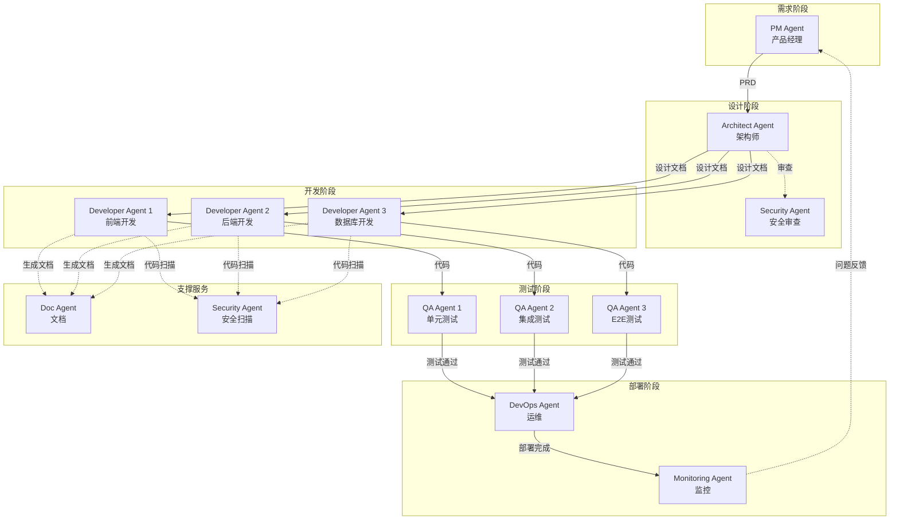
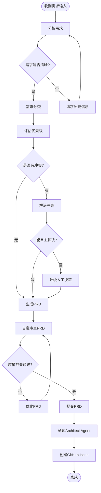
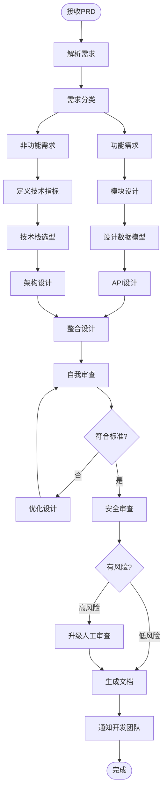
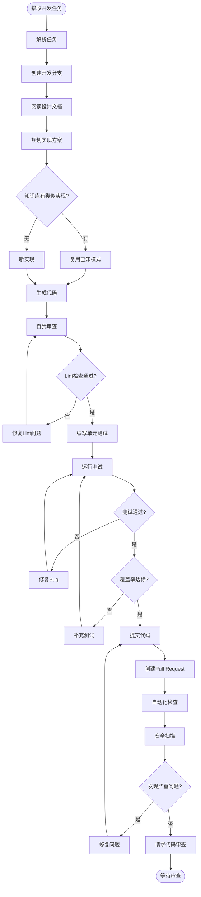
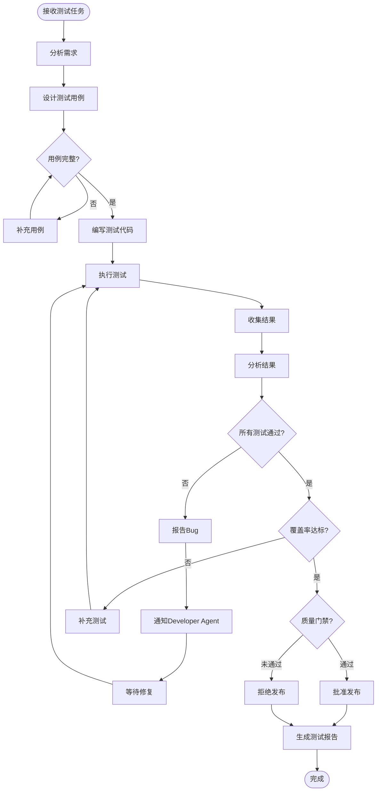
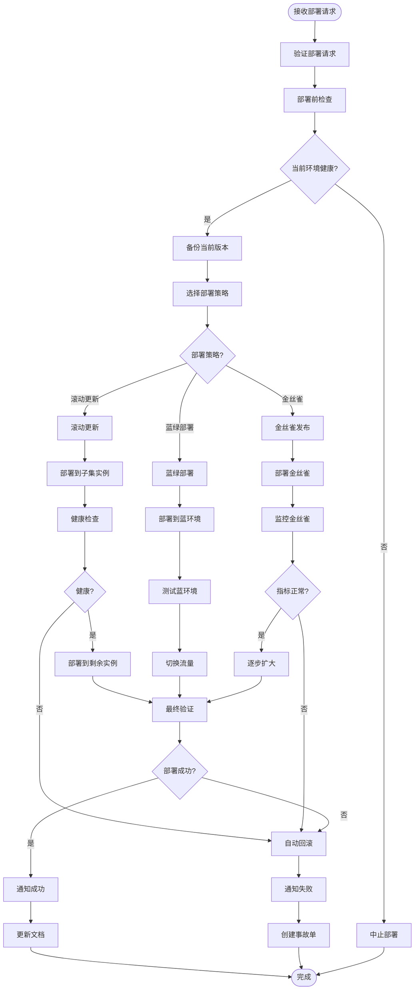
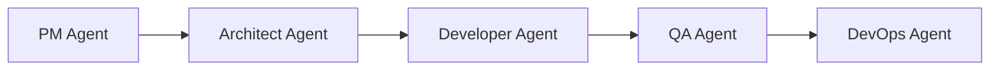
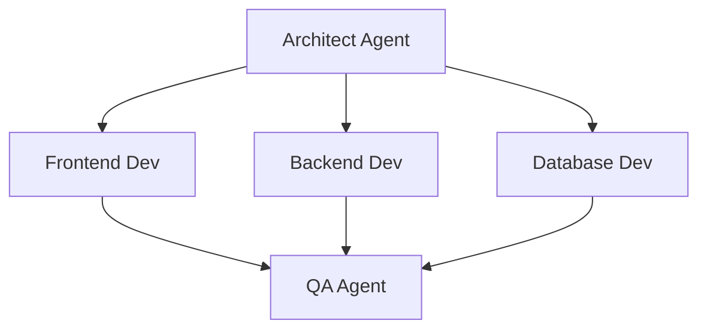
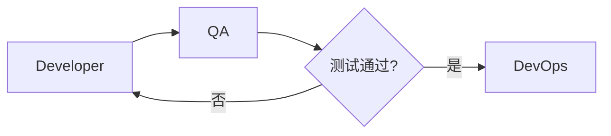
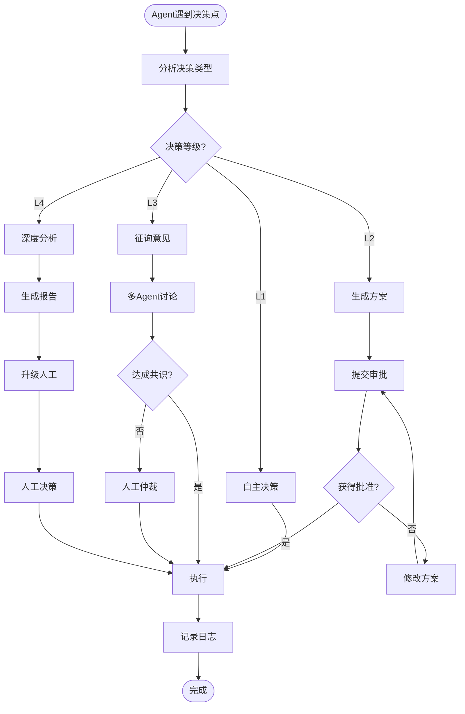

# AI Agent 角色定义文档

> 本文档定义了AI驱动软件开发工作流中所有Agent的角色、职责、能力和协作机制

---

## 📋 目录

- [概述](#概述)
- [Agent角色体系](#agent角色体系)
- [核心Agent定义](#核心agent定义)
  - [1. PM Agent (产品经理)](#1-pm-agent-产品经理)
  - [2. Architect Agent (架构师)](#2-architect-agent-架构师)
  - [3. Developer Agent (开发工程师)](#3-developer-agent-开发工程师)
  - [4. QA Agent (测试工程师)](#4-qa-agent-测试工程师)
  - [5. DevOps Agent (运维工程师)](#5-devops-agent-运维工程师)
- [辅助Agent定义](#辅助agent定义)
  - [6. Security Agent (安全专家)](#6-security-agent-安全专家)
  - [7. Monitoring Agent (监控专家)](#7-monitoring-agent-监控专家)
  - [8. Doc Agent (文档工程师)](#8-doc-agent-文档工程师)
- [Agent协作机制](#agent协作机制)
- [决策框架](#决策框架)
- [通信协议](#通信协议)
- [实施指南](#实施指南)

---

## 概述

### Agent体系设计原则

1. **单一职责原则**：每个Agent专注于特定领域
2. **协作优先**：Agent之间通过标准接口协作
3. **人机结合**：关键决策需要人工确认
4. **持续学习**：Agent从每次执行中积累经验

### Agent能力等级

| 等级 | 名称 | 能力描述 | 人工介入 |
|------|------|----------|----------|
| L1 | **执行者** | 按照明确指令执行标准任务 | 事后审查 |
| L2 | **分析者** | 分析问题并提供建议方案 | 事前确认 |
| L3 | **决策者** | 在权限范围内自主决策 | 异常介入 |
| L4 | **创新者** | 提出创新方案和优化建议 | 战略指导 |

---

## Agent角色体系

### 系统架构图



### Agent数量配置

#### 小型项目（1-2人团队）
```yaml
agents:
  pm: 1
  architect: 1 (可由PM兼任)
  developer: 2-3
  qa: 1
  devops: 1 (可由Developer兼任)
  security: 按需触发
  monitoring: 自动化
  doc: 自动化
```

#### 中型项目（3-8人团队）
```yaml
agents:
  pm: 1
  architect: 1
  developer: 5-10
  qa: 2-3
  devops: 1-2
  security: 1
  monitoring: 1
  doc: 1
```

#### 大型项目（10+人团队）
```yaml
agents:
  pm: 2-3
  architect: 2
  developer: 15-20
  qa: 5-8
  devops: 2-3
  security: 2
  monitoring: 2
  doc: 2
```

---

## 核心Agent定义

### 1. PM Agent (产品经理)

#### 基本信息

| 属性 | 值 |
|------|-----|
| **Agent ID** | `pm-agent-001` |
| **角色名称** | Product Manager Agent |
| **中文名称** | 产品经理Agent |
| **能力等级** | L2 (分析者) - L3 (决策者) |
| **工作阶段** | 需求阶段、反馈阶段 |

#### 核心职责

1. **需求收集与分析**
   - 从用户反馈、市场调研中提取需求
   - 分析需求的优先级和可行性
   - 识别需求冲突和依赖关系

2. **PRD文档生成**
   - 使用标准模板生成产品需求文档
   - 定义用户故事和验收标准
   - 规划功能模块和迭代计划

3. **需求管理**
   - 维护需求池和优先级排序
   - 跟踪需求实现状态
   - 处理需求变更

4. **干系人沟通**
   - 与Architect Agent同步技术可行性
   - 向人工PM汇报重大决策
   - 协调跨团队需求

#### 输入输出

**输入**：
```yaml
inputs:
  - type: "用户反馈"
    format: "文本/JSON"
    source: "反馈系统/客户访谈"
    example:
      user_id: "user_123"
      feedback: "希望支持批量导入功能"
      priority: "high"
      
  - type: "业务目标"
    format: "结构化文档"
    source: "战略规划/OKR"
    example:
      objective: "提升用户留存率"
      key_result: "DAU提升20%"
      
  - type: "市场调研"
    format: "报告文档"
    source: "竞品分析/行业报告"
```

**输出**：
```yaml
outputs:
  - type: "PRD文档"
    format: "Markdown"
    template: "prd/prd-template.md"
    location: "docs/prd/feature-{version}.md"
    
  - type: "用户故事"
    format: "GitHub Issue"
    template: "github-issue-templates/issue-05-business.md"
    
  - type: "需求变更通知"
    format: "JSON"
    target: ["Architect Agent", "Developer Agent"]
    example:
      change_type: "feature_addition"
      priority: "high"
      affected_modules: ["user_management"]
```

#### 决策权限

| 决策类型 | 权限级别 | 需要确认 | 示例 |
|---------|---------|---------|------|
| 功能优先级排序 | ✅ 完全自主 | ❌ 不需要 | 将"批量导入"提升为P0 |
| 小型功能调整 | ✅ 完全自主 | ⚠️ 事后通知 | 调整按钮文案 |
| 新增核心功能 | ⚠️ 需要确认 | ✅ 事前批准 | 新增支付模块 |
| 技术栈变更 | ❌ 无权限 | ✅ 需Architect决策 | 更换数据库 |
| 预算调整 | ❌ 无权限 | ✅ 需人工决策 | 增加云服务器 |

#### 工作流程



#### 提示词模板

**PRD生成提示词**：
```
你是一位资深产品经理Agent。请根据以下信息生成完整的PRD文档：

【背景信息】
{background_context}

【用户需求】
{user_requirements}

【业务目标】
{business_objectives}

【技术约束】
{technical_constraints}

【要求】
1. 使用模板: develop-rules/prd/prd-template.md
2. 包含完整的用户故事和验收标准
3. 定义清晰的功能边界
4. 评估实现复杂度和优先级
5. 识别潜在风险和依赖

【输出格式】
- Markdown格式
- 包含目录和章节导航
- 所有占位符必须填写
- 附带功能流程图(Mermaid)
```

**需求冲突解决提示词**：
```
你是一位产品经理Agent，需要解决以下需求冲突：

【冲突需求A】
{requirement_a}

【冲突需求B】
{requirement_b}

【分析维度】
1. 用户价值对比
2. 技术实现难度
3. 业务优先级
4. 资源消耗
5. 上线时间要求

【输出】
- 冲突原因分析
- 推荐方案（含理由）
- 备选方案
- 如无法决策，说明原因并@人工PM
```

#### 性能指标

```yaml
performance_metrics:
  - metric: "PRD质量得分"
    target: ">= 85分"
    calculation: "人工评审打分"
    
  - metric: "需求理解准确率"
    target: ">= 90%"
    calculation: "实现后与需求匹配度"
    
  - metric: "响应时间"
    target: "< 5分钟"
    calculation: "从输入到输出PRD的时间"
    
  - metric: "需求变更率"
    target: "< 15%"
    calculation: "开发过程中需求变更次数/总需求"
```

#### 学习与改进

**经验积累**：
```python
class PMAgentLearning:
    def record_experience(self, task):
        """记录每次PRD生成经验"""
        experience = {
            "task_id": task.id,
            "requirement_type": task.type,
            "complexity": task.complexity,
            "prd_structure": task.prd_template_used,
            "review_score": task.review_score,
            "issues_found": task.issues,
            "time_taken": task.duration
        }
        
        # 存入知识库
        self.knowledge_base.add(experience)
        
        # 更新提示词模板
        if experience["review_score"] > 90:
            self.optimize_prompt_template(experience)
    
    def apply_learned_patterns(self, new_requirement):
        """应用已学习的模式"""
        # 搜索相似需求
        similar = self.knowledge_base.search(
            type=new_requirement.type,
            similarity_threshold=0.8
        )
        
        if similar:
            return self.reuse_template(similar.best_match)
        else:
            return self.generate_from_scratch()
```

---

### 2. Architect Agent (架构师)

#### 基本信息

| 属性 | 值 |
|------|-----|
| **Agent ID** | `arch-agent-001` |
| **角色名称** | Architect Agent |
| **中文名称** | 架构师Agent |
| **能力等级** | L3 (决策者) - L4 (创新者) |
| **工作阶段** | 设计阶段、技术评审 |

#### 核心职责

1. **系统架构设计**
   - 分析PRD并设计系统架构
   - 选择技术栈和框架
   - 定义模块划分和接口规范
   - 绘制架构图和数据流图

2. **技术方案评审**
   - 评估技术方案的可行性
   - 识别技术风险和瓶颈
   - 提供优化建议

3. **数据库设计**
   - 设计数据模型和ER图
   - 定义表结构、索引、约束
   - 规划数据库性能优化策略

4. **API规范制定**
   - 设计RESTful API接口
   - 定义请求/响应格式
   - 制定接口版本管理策略

#### 输入输出

**输入**：
```yaml
inputs:
  - type: "PRD文档"
    source: "PM Agent"
    required_fields:
      - 功能需求清单
      - 非功能性需求
      - 性能要求
      - 安全要求
      
  - type: "技术约束"
    format: "YAML/JSON"
    example:
      cloud_provider: "AWS"
      budget: "$5000/month"
      performance: 
        response_time: "< 200ms"
        concurrent_users: 10000
      
  - type: "现有系统分析"
    source: "代码库扫描"
    content:
      - 当前技术栈
      - 系统瓶颈
      - 技术债务
```

**输出**：
```yaml
outputs:
  - type: "系统架构文档"
    location: "docs/design/system-architecture.md"
    content:
      - 架构图(Mermaid/PlantUML)
      - 技术栈说明
      - 模块划分
      - 部署架构
      - 扩展性方案
      
  - type: "数据库设计文档"
    template: "db/db-template.md"
    location: "docs/db/database-design.md"
    
  - type: "API规范文档"
    template: "api/api-template.md"
    location: "docs/api/api-specification.md"
    
  - type: "技术选型报告"
    format: "Markdown"
    content:
      - 候选方案对比
      - 推荐方案及理由
      - 风险评估
```

#### 决策权限

| 决策类型 | 权限级别 | 需要确认 | 示例 |
|---------|---------|---------|------|
| 代码架构模式 | ✅ 完全自主 | ❌ 不需要 | 采用MVC架构 |
| 数据库表设计 | ✅ 完全自主 | ⚠️ 事后审查 | 设计用户表结构 |
| 开源框架选择 | ✅ 完全自主 | ⚠️ 事后通知 | 选择Spring Boot |
| 核心技术栈变更 | ⚠️ 需要确认 | ✅ 事前批准 | 从Java迁移到Go |
| 云服务商切换 | ❌ 无权限 | ✅ 需人工决策 | 从AWS切换到GCP |

#### 工作流程



#### 提示词模板

**系统架构设计提示词**：
```
你是一位资深架构师Agent。请根据以下PRD设计系统架构：

【PRD摘要】
{prd_summary}

【功能需求】
{functional_requirements}

【非功能需求】
- 性能: {performance_requirements}
- 安全: {security_requirements}
- 可用性: {availability_requirements}
- 可扩展性: {scalability_requirements}

【技术约束】
{technical_constraints}

【设计任务】
1. 分析需求，识别核心模块
2. 设计系统架构图(使用Mermaid)
3. 选择合适的技术栈
4. 定义模块间接口
5. 评估性能和扩展性
6. 识别技术风险

【输出要求】
- 使用模板: develop-rules/design/architecture-template.md
- 包含详细的技术选型理由
- 提供至少2个备选方案
- 评估每个方案的优缺点
- 给出推荐方案及依据
```

**数据库设计提示词**：
```
你是一位数据库架构师Agent。请根据以下业务需求设计数据库：

【业务实体】
{business_entities}

【业务规则】
{business_rules}

【性能要求】
- 数据量: {data_volume}
- QPS: {queries_per_second}
- 响应时间: {response_time}

【设计任务】
1. 识别核心实体和关系
2. 设计表结构(字段、类型、约束)
3. 定义索引策略
4. 设计分库分表方案(如需要)
5. 制定缓存策略
6. 评估性能瓶颈

【输出要求】
- 使用模板: develop-rules/db/db-template.md
- 包含ER图(Mermaid)
- 所有表必须有详细字段说明
- 索引设计要有理由说明
- 提供性能优化建议
```

#### 设计原则

```yaml
design_principles:
  - name: "高内聚、低耦合"
    description: "模块内部高度相关，模块间依赖最小"
    check_method: "分析模块依赖图"
    
  - name: "可扩展性优先"
    description: "设计时考虑未来扩展性"
    check_method: "验证是否支持水平扩展"
    
  - name: "安全性内建"
    description: "安全机制融入架构设计"
    check_method: "Security Agent审查"
    
  - name: "性能可观测"
    description: "关键路径可监控、可追踪"
    check_method: "验证日志和监控覆盖"
    
  - name: "容错与降级"
    description: "设计失败处理和降级方案"
    check_method: "验证是否有Circuit Breaker"
```

#### 性能指标

```yaml
performance_metrics:
  - metric: "架构质量评分"
    target: ">= 90分"
    dimensions:
      - 可扩展性 (20%)
      - 性能 (20%)
      - 安全性 (20%)
      - 可维护性 (20%)
      - 成本效益 (20%)
      
  - metric: "设计评审通过率"
    target: ">= 95%"
    calculation: "首次评审通过的设计数/总设计数"
    
  - metric: "架构缺陷率"
    target: "< 5%"
    calculation: "开发阶段发现的架构问题数/总模块数"
```

---

### 3. Developer Agent (开发工程师)

#### 基本信息

| 属性 | 值 |
|------|-----|
| **Agent ID** | `dev-agent-{specialty}-{id}` |
| **角色名称** | Developer Agent |
| **中文名称** | 开发工程师Agent |
| **能力等级** | L1 (执行者) - L2 (分析者) |
| **工作阶段** | 开发阶段、代码审查 |
| **专业分类** | Frontend / Backend / Database / Mobile |

#### 核心职责

1. **代码实现**
   - 根据设计文档实现功能
   - 编写高质量、可维护的代码
   - 遵循编码规范和最佳实践
   - 处理异常和边界情况

2. **单元测试**
   - 编写单元测试用例
   - 确保测试覆盖率达标
   - 测试边界条件和异常场景

3. **代码审查**
   - 审查其他Agent提交的代码
   - 识别潜在Bug和性能问题
   - 提供改进建议

4. **Bug修复**
   - 定位和修复Bug
   - 回归测试验证
   - 更新相关文档

#### 专业分类

**Frontend Developer Agent**：
```yaml
specialty: "frontend"
tech_stack:
  - React / Vue / Angular
  - TypeScript / JavaScript
  - CSS / Tailwind / SCSS
  - Webpack / Vite
  
responsibilities:
  - UI组件实现
  - 状态管理
  - API对接
  - 性能优化
  - 响应式设计
```

**Backend Developer Agent**：
```yaml
specialty: "backend"
tech_stack:
  - Java / Python / Node.js / Go
  - Spring Boot / Django / Express / Gin
  - MySQL / PostgreSQL / MongoDB
  - Redis / RabbitMQ / Kafka
  
responsibilities:
  - API接口实现
  - 业务逻辑开发
  - 数据库操作
  - 性能优化
  - 安全防护
```

**Database Developer Agent**：
```yaml
specialty: "database"
tech_stack:
  - SQL优化
  - 数据库设计
  - 存储过程
  - 数据迁移
  
responsibilities:
  - 实现表结构
  - 编写存储过程
  - 优化查询性能
  - 数据迁移脚本
  - 索引优化
```

#### 输入输出

**输入**：
```yaml
inputs:
  - type: "开发任务Issue"
    source: "GitHub Issue"
    required_fields:
      - 任务描述
      - 验收标准
      - 技术方案
      - 优先级
      
  - type: "设计文档"
    source: "Architect Agent"
    content:
      - API规范
      - 数据模型
      - 接口定义
      
  - type: "代码规范"
    source: "coding/coding.md"
    
  - type: "现有代码库"
    source: "Git Repository"
```

**输出**：
```yaml
outputs:
  - type: "功能代码"
    location: "src/{module}/"
    requirements:
      - 遵循编码规范
      - 包含完整注释
      - 通过Lint检查
      
  - type: "单元测试"
    location: "tests/unit/"
    requirements:
      - 覆盖率 >= 80%
      - 测试命名规范
      - Mock外部依赖
      
  - type: "Pull Request"
    platform: "GitHub"
    content:
      - 变更描述
      - 测试结果
      - 截图/演示(如有UI)
      
  - type: "API文档更新"
    trigger: "接口变更时"
    action: "自动更新Swagger/OpenAPI"
```

#### 决策权限

| 决策类型 | 权限级别 | 需要确认 | 示例 |
|---------|---------|---------|------|
| 算法实现细节 | ✅ 完全自主 | ❌ 不需要 | 选择排序算法 |
| 变量命名 | ✅ 完全自主 | ❌ 不需要 | 命名函数和变量 |
| 小型重构 | ✅ 完全自主 | ⚠️ PR中说明 | 提取公共方法 |
| 引入新依赖库 | ⚠️ 需要确认 | ✅ PR中说明理由 | 引入lodash |
| 修改公共API | ⚠️ 需要确认 | ✅ Architect审查 | 修改接口签名 |
| 架构调整 | ❌ 无权限 | ✅ 需Architect决策 | 改变模块结构 |

#### 工作流程



#### 提示词模板

**代码实现提示词**：
```
你是一位{specialty}开发工程师Agent。请实现以下功能：

【任务描述】
{task_description}

【设计文档】
- API规范: {api_spec}
- 数据模型: {data_model}
- 业务规则: {business_rules}

【技术要求】
- 编程语言: {language}
- 框架: {framework}
- 编码规范: coding/coding.md
- 注释规范: coding/comment.md

【实现要求】
1. 遵循编码规范
2. 添加详细注释(参考comment.md)
3. 处理所有异常情况
4. 实现输入验证
5. 编写单元测试(覆盖率>=80%)
6. 性能考虑(时间复杂度、空间复杂度)

【输出格式】
- 功能代码文件
- 单元测试文件
- 简要说明文档

【示例】
{code_example}
```

**代码审查提示词**：
```
你是一位代码审查Agent。请审查以下Pull Request：

【变更摘要】
{pr_summary}

【代码变更】
{code_diff}

【审查维度】
1. **代码质量**
   - 是否遵循编码规范
   - 是否有代码异味
   - 命名是否清晰
   
2. **功能正确性**
   - 是否实现需求
   - 是否有潜在Bug
   - 边界条件处理
   
3. **性能**
   - 时间复杂度
   - 空间复杂度
   - 数据库查询优化
   
4. **安全性**
   - SQL注入风险
   - XSS风险
   - 敏感数据处理
   
5. **可维护性**
   - 代码结构
   - 注释完整性
   - 测试覆盖率

【输出格式】
- 总体评价(Approve/Request Changes/Comment)
- 具体问题列表(行号、问题描述、建议修改)
- 优点总结
```

**Bug修复提示词**：
```
你是一位Bug修复专家Agent。请修复以下Bug：

【Bug描述】
{bug_description}

【复现步骤】
{reproduction_steps}

【错误信息】
{error_log}

【相关代码】
{relevant_code}

【修复流程】
1. 分析错误原因
2. 定位问题代码
3. 提供修复方案
4. 编写回归测试
5. 验证修复效果

【输出要求】
- 根因分析
- 修复代码
- 测试用例
- 验证结果
```

#### 性能指标

```yaml
performance_metrics:
  - metric: "代码质量得分"
    target: ">= 85分"
    tools: ["SonarQube", "CodeClimate"]
    
  - metric: "测试覆盖率"
    target: ">= 80%"
    critical_modules: ">= 90%"
    
  - metric: "PR合并率"
    target: ">= 95%"
    calculation: "首次提交即合并的PR数/总PR数"
    
  - metric: "Bug修复时间"
    target:
      - P0: "< 4小时"
      - P1: "< 24小时"
      - P2: "< 72小时"
      
  - metric: "代码审查发现问题率"
    target: "< 10%"
    calculation: "审查发现问题数/总提交数"
```

#### 学习与改进

```python
class DeveloperAgentLearning:
    def learn_from_code_review(self, pr, review_comments):
        """从代码审查中学习"""
        issues = self.categorize_issues(review_comments)
        
        for issue in issues:
            pattern = {
                "issue_type": issue.type,
                "code_pattern": issue.code_before,
                "fix_pattern": issue.code_after,
                "reviewer_feedback": issue.comment
            }
            
            self.knowledge_base.add_anti_pattern(pattern)
        
        # 更新代码生成模板
        if self.should_update_template(issues):
            self.update_code_templates(issues)
    
    def reuse_working_solutions(self, task):
        """复用已验证的解决方案"""
        similar_tasks = self.knowledge_base.search_similar(task)
        
        if similar_tasks:
            best_solution = self.rank_solutions(similar_tasks)
            return self.adapt_solution(best_solution, task)
        
        return None
```

---

### 4. QA Agent (测试工程师)

#### 基本信息

| 属性 | 值 |
|------|-----|
| **Agent ID** | `qa-agent-{type}-{id}` |
| **角色名称** | QA Agent |
| **中文名称** | 测试工程师Agent |
| **能力等级** | L2 (分析者) - L3 (决策者) |
| **工作阶段** | 测试阶段、质量把关 |
| **测试类型** | Unit / Integration / E2E / Performance |

#### 核心职责

1. **测试用例设计**
   - 根据需求设计测试用例
   - 覆盖正常流程和异常场景
   - 设计边界条件测试
   - 设计性能测试场景

2. **自动化测试**
   - 编写自动化测试脚本
   - 配置CI/CD测试流水线
   - 维护测试框架
   - 生成测试报告

3. **质量把关**
   - 执行测试并记录结果
   - 评估代码质量
   - 决定是否通过质量门禁
   - 识别质量风险

4. **Bug管理**
   - 发现并报告Bug
   - 跟踪Bug修复进度
   - 验证Bug修复效果
   - 分析Bug趋势

#### 测试类型专业化

**Unit Test QA Agent**：
```yaml
type: "unit_test"
scope: "函数/类级别"
responsibility:
  - 验证单元测试覆盖率
  - 审查测试用例质量
  - 补充缺失的测试
  - Mock外部依赖
tools:
  - Jest / Mocha (JavaScript)
  - JUnit / TestNG (Java)
  - pytest (Python)
  - go test (Go)
```

**Integration Test QA Agent**：
```yaml
type: "integration_test"
scope: "模块/服务级别"
responsibility:
  - 测试API接口
  - 测试服务间集成
  - 测试数据库交互
  - 测试消息队列
tools:
  - Postman / REST Assured
  - TestContainers
  - WireMock
```

**E2E Test QA Agent**：
```yaml
type: "e2e_test"
scope: "端到端用户流程"
responsibility:
  - 测试完整业务流程
  - 测试跨系统集成
  - 验证用户体验
  - 回归测试
tools:
  - Playwright / Cypress
  - Selenium
  - Puppeteer
```

**Performance Test QA Agent**：
```yaml
type: "performance_test"
scope: "性能和负载"
responsibility:
  - 压力测试
  - 负载测试
  - 性能基准测试
  - 性能瓶颈分析
tools:
  - JMeter / Gatling
  - Locust
  - k6
```

#### 输入输出

**输入**：
```yaml
inputs:
  - type: "PRD文档"
    source: "PM Agent"
    usage: "设计测试用例"
    
  - type: "功能代码"
    source: "Developer Agent"
    usage: "执行测试"
    
  - type: "API文档"
    source: "Architect Agent"
    usage: "接口测试"
    
  - type: "测试指南"
    source: "testing/*.md"
    usage: "测试规范"
```

**输出**：
```yaml
outputs:
  - type: "测试用例"
    location: "tests/{type}/"
    format: "代码文件"
    
  - type: "测试报告"
    location: "test-reports/"
    format: "HTML/JSON"
    content:
      - 执行结果
      - 覆盖率
      - 失败用例
      - 性能数据
      
  - type: "Bug报告"
    platform: "GitHub Issue"
    template: "github-issue-templates/bug-report.md"
    
  - type: "质量评估"
    format: "Markdown"
    content:
      - 质量得分
      - 风险评估
      - 通过/拒绝决策
```

#### 决策权限

| 决策类型 | 权限级别 | 需要确认 | 示例 |
|---------|---------|---------|------|
| 补充测试用例 | ✅ 完全自主 | ❌ 不需要 | 增加边界条件测试 |
| 标记测试为失败 | ✅ 完全自主 | ❌ 不需要 | 测试未通过 |
| 拒绝PR合并 | ✅ 完全自主 | ⚠️ 需说明理由 | 质量不达标 |
| 批准生产部署 | ⚠️ 需要确认 | ✅ 基于测试结果 | 所有测试通过 |
| 修改质量标准 | ❌ 无权限 | ✅ 需团队决策 | 降低覆盖率要求 |

#### 工作流程



#### 提示词模板

**测试用例设计提示词**：
```
你是一位资深测试工程师Agent。请为以下功能设计测试用例：

【功能描述】
{feature_description}

【验收标准】
{acceptance_criteria}

【API接口】
{api_specification}

【测试类型】
{test_type} # unit/integration/e2e

【设计要求】
1. 正常流程测试 (Happy Path)
2. 异常场景测试 (Error Cases)
3. 边界条件测试 (Boundary Cases)
4. 安全测试 (Security)
5. 性能测试 (Performance)

【输出格式】
使用Given-When-Then格式：
- Given: 前置条件
- When: 执行操作
- Then: 预期结果

【参考指南】
{test_type}-testing-guide.md
```

**自动化测试生成提示词**：
```
你是一位自动化测试专家Agent。请根据测试用例生成自动化测试代码：

【测试用例】
{test_cases}

【测试框架】
{test_framework} # Jest/JUnit/pytest/Playwright

【被测代码】
{code_to_test}

【要求】
1. 使用测试框架的最佳实践
2. Mock所有外部依赖
3. 每个用例独立可运行
4. 清晰的断言和错误消息
5. 适当的setup和teardown

【输出】
- 测试代码文件
- Mock配置
- 测试数据fixtures
```

**Bug报告提示词**：
```
你是一位Bug报告专家Agent。请创建详细的Bug报告：

【Bug信息】
- 严重程度: {severity}
- 发现阶段: {stage}
- 测试用例: {test_case}
- 失败信息: {failure_message}

【环境信息】
- 分支: {git_branch}
- Commit: {git_commit}
- 测试环境: {environment}

【报告要求】
1. 清晰的标题
2. 详细的复现步骤
3. 预期结果 vs 实际结果
4. 错误日志/截图
5. 环境信息
6. 严重程度评估
7. 建议修复方案

使用模板: github-issue-templates/bug-report.md
```

#### 质量门禁标准

```yaml
quality_gates:
  unit_test:
    coverage: ">= 80%"
    pass_rate: "100%"
    duration: "< 5分钟"
    
  integration_test:
    pass_rate: "100%"
    duration: "< 15分钟"
    
  e2e_test:
    critical_scenarios: "100%"
    regression_tests: ">= 95%"
    duration: "< 30分钟"
    
  performance_test:
    response_time_p95: "< 200ms"
    error_rate: "< 0.1%"
    throughput: ">= 1000 QPS"
    
  code_quality:
    sonarqube_score: ">= 85"
    critical_issues: "0"
    major_issues: "< 5"
    
  security_scan:
    critical_vulnerabilities: "0"
    high_vulnerabilities: "0"
    medium_vulnerabilities: "< 5"
```

#### 性能指标

```yaml
performance_metrics:
  - metric: "测试覆盖率"
    target: ">= 80%"
    critical_modules: ">= 90%"
    
  - metric: "Bug发现率"
    target: "尽可能高"
    calculation: "测试阶段发现Bug数"
    
  - metric: "Bug逃逸率"
    target: "< 5%"
    calculation: "生产环境Bug数/总Bug数"
    
  - metric: "测试执行时间"
    target: 
      unit: "< 5分钟"
      integration: "< 15分钟"
      e2e: "< 30分钟"
      
  - metric: "误报率"
    target: "< 2%"
    calculation: "误报Bug数/总报Bug数"
```

---

### 5. DevOps Agent (运维工程师)

#### 基本信息

| 属性 | 值 |
|------|-----|
| **Agent ID** | `devops-agent-001` |
| **角色名称** | DevOps Agent |
| **中文名称** | 运维工程师Agent |
| **能力等级** | L2 (分析者) - L3 (决策者) |
| **工作阶段** | 部署阶段、运维阶段 |

#### 核心职责

1. **CI/CD管理**
   - 配置和维护CI/CD流水线
   - 自动化构建和测试
   - 部署自动化
   - 环境管理

2. **基础设施管理**
   - 使用IaC(Infrastructure as Code)管理基础设施
   - 资源监控和优化
   - 成本控制
   - 容量规划

3. **部署管理**
   - 执行部署计划
   - 滚动更新
   - 蓝绿部署
   - 金丝雀发布

4. **故障处理**
   - 监控告警响应
   - 故障诊断和恢复
   - 自动回滚
   - 事后分析

#### 输入输出

**输入**：
```yaml
inputs:
  - type: "构建产物"
    source: "CI Pipeline"
    format: "Docker Image / JAR / Binary"
    
  - type: "部署配置"
    source: "Git Repository"
    files:
      - Dockerfile
      - docker-compose.yml
      - k8s manifests
      - terraform files
      
  - type: "部署请求"
    source: "QA Agent / 人工"
    content:
      - 版本号
      - 目标环境
      - 部署策略
      
  - type: "监控数据"
    source: "Monitoring System"
    metrics:
      - CPU/Memory usage
      - Request rate
      - Error rate
      - Response time
```

**输出**：
```yaml
outputs:
  - type: "部署报告"
    location: "deploy-reports/"
    content:
      - 部署状态
      - 健康检查结果
      - 回滚方案
      - 部署日志
      
  - type: "基础设施状态"
    format: "Dashboard"
    metrics:
      - 资源使用率
      - 成本
      - 服务健康度
      
  - type: "告警通知"
    channels: ["Slack", "Email", "PagerDuty"]
    triggers:
      - 服务宕机
      - 错误率飙升
      - 资源耗尽
      
  - type: "事故报告"
    template: "incident-report.md"
    content:
      - 事故时间线
      - 根因分析
      - 影响范围
      - 改进措施
```

#### 决策权限

| 决策类型 | 权限级别 | 需要确认 | 示例 |
|---------|---------|---------|------|
| 测试环境部署 | ✅ 完全自主 | ❌ 不需要 | 部署到Dev/Staging |
| 资源扩容(小) | ✅ 完全自主 | ⚠️ 事后通知 | 增加1个实例 |
| 自动回滚 | ✅ 完全自主 | ⚠️ 立即通知 | 部署失败回滚 |
| 生产环境部署 | ⚠️ 需要确认 | ✅ QA批准 | 发布新版本 |
| 资源扩容(大) | ⚠️ 需要确认 | ✅ 成本评估 | 增加10个实例 |
| 基础设施变更 | ❌ 受限 | ✅ 架构师审批 | 更换数据库 |

#### 工作流程

**部署流程**：


#### 提示词模板

**部署计划生成提示词**：
```
你是一位DevOps专家Agent。请制定部署计划：

【部署信息】
- 应用名称: {app_name}
- 版本: {version}
- 目标环境: {environment}
- 当前版本: {current_version}

【变更内容】
{change_summary}

【制定计划】
1. 部署前检查清单
2. 选择部署策略(滚动/蓝绿/金丝雀)
3. 部署步骤详解
4. 健康检查指标
5. 回滚方案
6. 预计停机时间
7. 风险评估

【输出格式】
使用模板: workflow/deployment-plan.md
```

**故障诊断提示词**：
```
你是一位故障诊断专家Agent。请分析以下告警：

【告警信息】
- 告警时间: {alert_time}
- 告警级别: {severity}
- 告警内容: {alert_message}
- 服务: {service_name}

【监控数据】
- CPU: {cpu_usage}
- Memory: {memory_usage}
- Error Rate: {error_rate}
- Response Time: {response_time}

【相关日志】
{recent_logs}

【诊断流程】
1. 分析告警根因
2. 检查相关服务依赖
3. 查看近期变更
4. 判断影响范围
5. 提供恢复方案
6. 建议预防措施

【输出】
- 根因分析
- 紧急程度评估
- 恢复步骤
- 是否需要回滚
- 是否需要人工介入
```

**基础设施优化提示词**：
```
你是一位基础设施优化专家Agent。请分析资源使用情况：

【当前配置】
{infrastructure_config}

【使用数据(过去30天)】
- CPU平均使用率: {cpu_avg}
- CPU峰值: {cpu_peak}
- 内存平均使用率: {memory_avg}
- 内存峰值: {memory_peak}
- 网络流量: {network_traffic}
- 成本: {cost}

【业务数据】
- 平均QPS: {qps_avg}
- 峰值QPS: {qps_peak}
- 用户增长: {user_growth}

【优化任务】
1. 资源利用率分析
2. 识别浪费和瓶颈
3. 提供优化建议
4. 成本节省预估
5. 扩容建议

【输出】
- 优化方案
- 成本对比
- 风险评估
- 实施步骤
```

#### 自动化运维场景

**场景1：自动扩缩容**
```python
class AutoScalingAgent:
    def monitor_and_scale(self):
        """监控并自动扩缩容"""
        metrics = self.get_metrics()
        
        if metrics.cpu_usage > 80 or metrics.memory_usage > 85:
            # 高负载 - 扩容
            current_instances = self.get_instance_count()
            target_instances = min(
                current_instances + 2,
                self.config.max_instances
            )
            
            self.scale_out(target_instances)
            self.notify("扩容触发", f"从{current_instances}增加到{target_instances}")
            
        elif metrics.cpu_usage < 20 and metrics.memory_usage < 30:
            # 低负载 - 缩容
            current_instances = self.get_instance_count()
            if current_instances > self.config.min_instances:
                target_instances = max(
                    current_instances - 1,
                    self.config.min_instances
                )
                
                self.scale_in(target_instances)
                self.notify("缩容触发", f"从{current_instances}减少到{target_instances}")
```

**场景2：自动故障恢复**
```python
class AutoRecoveryAgent:
    def handle_service_down(self, service):
        """服务宕机自动恢复"""
        # 1. 确认故障
        if not self.verify_service_down(service):
            return
        
        # 2. 记录故障
        incident = self.create_incident(service)
        
        # 3. 尝试自动恢复
        recovery_steps = [
            self.restart_service,
            self.restart_container,
            self.recreate_instance,
            self.rollback_deployment
        ]
        
        for step in recovery_steps:
            try:
                step(service)
                if self.health_check(service):
                    self.resolve_incident(incident, step.__name__)
                    return
            except Exception as e:
                self.log_recovery_failure(step.__name__, e)
        
        # 4. 自动恢复失败，升级人工
        self.escalate_to_human(incident)
```

#### 性能指标

```yaml
performance_metrics:
  - metric: "部署成功率"
    target: ">= 99%"
    calculation: "成功部署数/总部署数"
    
  - metric: "平均部署时间"
    target: "< 15分钟"
    
  - metric: "MTTR (平均恢复时间)"
    target: "< 30分钟"
    
  - metric: "变更失败率"
    target: "< 5%"
    calculation: "失败变更数/总变更数"
    
  - metric: "资源利用率"
    target: "60-80%"
    note: "过低浪费，过高风险"
    
  - metric: "成本优化"
    target: "月度成本同比降低10%"
```

---

## 辅助Agent定义

### 6. Security Agent (安全专家)

#### 基本信息

| 属性 | 值 |
|------|-----|
| **Agent ID** | `security-agent-001` |
| **角色名称** | Security Agent |
| **中文名称** | 安全专家Agent |
| **能力等级** | L3 (决策者) |
| **工作阶段** | 全流程安全审查 |

#### 核心职责

1. **代码安全审查**
   - 扫描安全漏洞(SQL注入、XSS等)
   - 检查敏感数据处理
   - 验证加密实现
   - 审查权限控制

2. **依赖安全管理**
   - 扫描第三方依赖漏洞
   - 自动更新安全补丁
   - 评估依赖风险

3. **合规检查**
   - GDPR合规验证
   - 数据安全等级保护
   - 访问日志审计

4. **渗透测试**
   - 自动化安全测试
   - API安全测试
   - 身份认证测试

#### 决策权限

| 决策类型 | 权限级别 | 需要确认 | 示例 |
|---------|---------|---------|------|
| 阻止严重漏洞合并 | ✅ 完全自主 | ❌ 不需要 | SQL注入漏洞 |
| 要求修复中危漏洞 | ✅ 完全自主 | ⚠️ 设置期限 | 弱密码策略 |
| 批准安全例外 | ❌ 无权限 | ✅ 需安全团队 | 暂时禁用某检查 |

#### 自动化安全检查

```yaml
security_checks:
  - name: "SAST (静态应用安全测试)"
    tools: ["SonarQube", "Snyk", "Checkmarx"]
    trigger: "每次代码提交"
    severity_threshold: "High"
    
  - name: "DAST (动态应用安全测试)"
    tools: ["OWASP ZAP", "Burp Suite"]
    trigger: "部署到测试环境后"
    
  - name: "依赖扫描"
    tools: ["npm audit", "Snyk", "Dependabot"]
    trigger: "每日"
    auto_fix: "自动创建PR更新依赖"
    
  - name: "密钥扫描"
    tools: ["git-secrets", "truffleHog"]
    trigger: "每次commit"
    action: "阻止提交"
    
  - name: "容器扫描"
    tools: ["Trivy", "Clair"]
    trigger: "构建Docker镜像时"
```

---

### 7. Monitoring Agent (监控专家)

#### 基本信息

| 属性 | 值 |
|------|-----|
| **Agent ID** | `monitoring-agent-001` |
| **角色名称** | Monitoring Agent |
| **中文名称** | 监控专家Agent |
| **能力等级** | L2 (分析者) - L3 (决策者) |
| **工作阶段** | 生产运行阶段 |

#### 核心职责

1. **指标监控**
   - 收集系统指标
   - 分析性能趋势
   - 预测容量需求
   - 异常检测

2. **日志分析**
   - 聚合日志数据
   - 错误日志分析
   - 业务日志分析
   - 安全日志审计

3. **告警管理**
   - 智能告警(减少误报)
   - 告警优先级排序
   - 告警聚合和抑制
   - 告警路由

4. **可观测性**
   - 分布式追踪
   - 服务依赖图
   - 性能瓶颈分析

#### 监控指标体系

```yaml
monitoring_metrics:
  infrastructure:
    - CPU使用率
    - 内存使用率
    - 磁盘IO
    - 网络带宽
    
  application:
    - 请求率 (QPS)
    - 响应时间 (P50/P95/P99)
    - 错误率
    - 并发连接数
    
  business:
    - 用户活跃度
    - 转化率
    - 交易量
    - 收入

alerting_rules:
  - name: "高错误率"
    condition: "error_rate > 5%"
    duration: "5分钟"
    severity: "critical"
    action: "立即通知DevOps"
    
  - name: "响应时间慢"
    condition: "p95_latency > 1000ms"
    duration: "10分钟"
    severity: "warning"
    action: "通知开发团队"
```

---

### 8. Doc Agent (文档工程师)

#### 基本信息

| 属性 | 值 |
|------|-----|
| **Agent ID** | `doc-agent-001` |
| **角色名称** | Documentation Agent |
| **中文名称** | 文档工程师Agent |
| **能力等级** | L1 (执行者) |
| **工作阶段** | 全流程文档生成 |

#### 核心职责

1. **代码文档生成**
   - 从代码生成API文档
   - 生成函数/类注释
   - 生成README

2. **用户文档**
   - 用户手册
   - 快速开始指南
   - FAQ

3. **运维文档**
   - 部署文档
   - 故障排查手册
   - 运维手册

4. **文档维护**
   - 检测文档过期
   - 自动更新版本号
   - 生成变更日志

#### 自动化文档生成

```yaml
doc_generation:
  api_docs:
    source: "代码注释"
    tools: ["Swagger", "TypeDoc", "JavaDoc"]
    output: "docs/api/"
    trigger: "代码变更"
    
  user_docs:
    source: "PRD + 代码"
    template: "docs-templates/"
    output: "docs/user/"
    
  changelog:
    source: "Git commits"
    format: "CHANGELOG.md"
    trigger: "版本发布"
```

---

## Agent协作机制

### 协作模式

#### 1. 顺序协作 (Sequential)



**适用场景**：标准开发流程

**特点**：
- 明确的交接点
- 前一阶段完成后才开始下一阶段
- 职责清晰，不易混乱

#### 2. 并行协作 (Parallel)



**适用场景**：模块独立的开发任务

**特点**：
- 同时进行，提高效率
- 需要清晰的接口定义
- 最后统一集成和测试

#### 3. 迭代协作 (Iterative)



**适用场景**：Bug修复、质量提升

**特点**：
- 持续改进直到满足标准
- 快速反馈循环
- 质量优先

### 通信协议

#### 消息格式

```json
{
  "message_id": "msg_20250120_001",
  "timestamp": "2025-01-20T10:30:00Z",
  "from": {
    "agent_type": "pm",
    "agent_id": "pm-agent-001"
  },
  "to": {
    "agent_type": "architect",
    "agent_id": "arch-agent-001"
  },
  "message_type": "task_assignment",
  "priority": "high",
  "content": {
    "task_id": "TASK-123",
    "title": "设计用户管理系统",
    "prd_document": "docs/prd/user-management.md",
    "deadline": "2025-01-25T18:00:00Z",
    "requirements": {
      "performance": "response_time < 200ms",
      "scalability": "support 10k concurrent users"
    }
  },
  "attachments": [
    {
      "type": "document",
      "path": "docs/prd/user-management.md"
    }
  ]
}
```

#### 通信渠道

```yaml
communication_channels:
  - type: "GitHub Issue"
    usage: "任务分配和追踪"
    
  - type: "Pull Request"
    usage: "代码审查和讨论"
    
  - type: "Message Queue"
    usage: "Agent间异步通信"
    
  - type: "Shared Database"
    usage: "状态共享"
    
  - type: "Notification Service"
    usage: "告警和通知"
```

---

## 决策框架

### 决策等级系统

#### Level 1: 自主执行
- Agent完全自主决策和执行
- 事后记录日志
- 不需要人工确认

**示例**：
- 格式化代码
- 运行单元测试
- 生成API文档
- 补充测试用例

#### Level 2: 提议审批
- Agent分析并提供建议
- 等待人工或上级Agent确认
- 确认后执行

**示例**：
- 引入新的依赖库
- 修改公共API接口
- 数据库schema变更
- 生产环境部署

#### Level 3: 联合决策
- 多个Agent共同参与
- 需要达成共识
- 可能需要人工仲裁

**示例**：
- 架构重构方案
- 技术栈迁移
- 重大需求变更

#### Level 4: 升级决策
- 超出Agent权限范围
- 必须由人工决策
- Agent提供分析和建议

**示例**：
- 预算调整
- 团队组织变更
- 战略方向调整

### 决策流程图



---

## 实施指南

### Phase 1: 基础设施准备 (1周)

```yaml
tasks:
  - name: "搭建Agent平台"
    tools:
      - LangChain / AutoGen
      - Vector Database (Pinecone/Weaviate)
      - Message Queue (RabbitMQ/Redis)
    
  - name: "配置通信渠道"
    setup:
      - GitHub API配置
      - 消息队列
      - 共享数据库
    
  - name: "准备模板库"
    content:
      - 所有文档模板
      - 提示词模板
      - 代码模板
```

### Phase 2: Agent开发 (2-3周)

```yaml
priority_order:
  1: "PM Agent"
  2: "Developer Agent"
  3: "QA Agent"
  4: "Architect Agent"
  5: "DevOps Agent"
  6: "Security Agent"
  7: "Monitoring Agent"
  8: "Doc Agent"

development_approach:
  - 每个Agent独立开发和测试
  - 使用标准接口
  - 提供Mock实现供测试
```

### Phase 3: 集成测试 (1-2周)

```yaml
test_scenarios:
  - 完整开发流程测试
  - Agent协作测试
  - 错误处理测试
  - 性能测试
  - 人机协作测试
```

### Phase 4: 试点项目 (2-4周)

```yaml
pilot_project:
  scope: "小型功能开发"
  team: "2-3人 + Agent团队"
  metrics:
    - 开发效率提升
    - 代码质量
    - Bug率
    - 人工介入次数
```

### Phase 5: 持续优化 (ongoing)

```yaml
optimization_areas:
  - 提示词优化
  - 决策准确率提升
  - Agent能力扩展
  - 知识库积累
  - 工作流程优化
```

---

## 附录

### A. Agent配置示例

```yaml
# pm-agent-config.yml
agent_id: "pm-agent-001"
agent_type: "pm"
llm_config:
  model: "claude-sonnet-4"
  temperature: 0.3
  max_tokens: 4000
  
capabilities:
  - "requirement_analysis"
  - "prd_generation"
  - "priority_ranking"
  - "stakeholder_communication"
  
templates:
  prd: "prd/prd-template.md"
  user_story: "github-issue-templates/issue-05-business.md"
  
decision_authority:
  feature_priority: "full"
  requirement_change: "propose"
  budget_adjustment: "none"
  
knowledge_base:
  path: "knowledge-base/pm/"
  auto_update: true
  
performance_tracking:
  enabled: true
  metrics:
    - "prd_quality_score"
    - "requirement_accuracy"
    - "response_time"
```

### B. 提示词库结构

```
prompts/
├── pm/
│   ├── prd-generation.md
│   ├── requirement-analysis.md
│   └── conflict-resolution.md
├── architect/
│   ├── architecture-design.md
│   ├── database-design.md
│   └── api-design.md
├── developer/
│   ├── code-generation.md
│   ├── code-review.md
│   └── bug-fix.md
├── qa/
│   ├── test-case-design.md
│   ├── test-automation.md
│   └── bug-report.md
└── devops/
    ├── deployment-plan.md
    ├── incident-response.md
    └── infrastructure-optimization.md
```

### C. 性能监控Dashboard

```yaml
dashboard_metrics:
  agent_performance:
    - 任务完成率
    - 平均响应时间
    - 质量得分
    - 人工介入率
    
  system_performance:
    - Agent并发数
    - 消息处理延迟
    - API调用成本
    - 错误率
    
  business_impact:
    - 开发效率提升
    - Bug减少率
    - 上线速度
    - 成本节省
```

---

**文档版本**: v1.0.0  
**创建日期**: 2025-01-20  
**维护团队**: AI Agent 开发团队  
**反馈渠道**: GitHub Issues